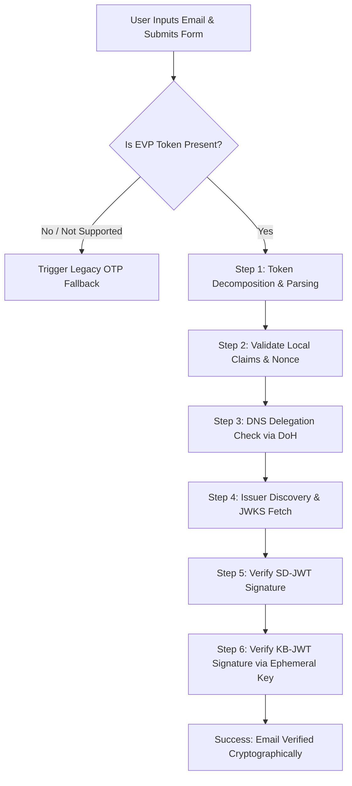

# Email Verification Protocol (EVP) Relying Party - Implementation Blueprint

This guide provides a comprehensive blueprint and complete source code to implement a fully client-side **Email Verification Protocol (EVP)** Relying Party (RP) demo. 

By providing this file to any AI coding assistant (like Gemini, Claude, Cursor, or v0), the assistant will be able to recreate the exact, fully functional, premium-designed demo.

---

## Technical Architecture

The application is structured as a single-page application (SPA) running entirely in the browser. It uses [jose](https://github.com/panva/jose) (loaded via CDN) to perform in-browser cryptographic validation.



### Key Technical Patterns Implemented:
1. **Dynamic Session Nonce**: A cryptographically secure 24-byte random nonce is generated on page load and bound to the hidden input.
2. **DNS-over-HTTPS (DoH)**: Uses Google's DoH API (`https://dns.google/resolve`) to verify domain delegation authority by querying `_email-verification.<domain>` TXT records.
3. **Google CORS Bypass**: Since identity providers (like `accounts.google.com`) do not return CORS headers on their `/.well-known/email-verification` endpoints, a hardcoded fallback dictionary is provided to bypass the fetch and obtain the public keys.
4. **Two-Column Developer Dashboard**: Layout featuring the sign-up form on the left, and an interactive **Protocol Inspector** (with a step-by-step cryptographic trace and terminal logs) on the right.

---

## Project Structure & Source Code

Create the following four files in the same directory:

```text
evp-demo/
├── package.json
├── index.html
├── style.css
└── app.js
```

### 1. `package.json`
```json
{
  "name": "evp-demo-rp",
  "version": "1.0.0",
  "description": "Email Verification Protocol (EVP) Relying Party Demo",
  "type": "module",
  "scripts": {
    "start": "npx http-server -p 3000",
    "dev": "npx http-server -p 3000"
  }
}
```

### 2. `index.html`
```html
<!DOCTYPE html>
<html lang="en">
<head>
  <meta charset="UTF-8">
  <meta name="viewport" content="width=device-width, initial-scale=1.0">
  <title>EVP Cryptographic Verification</title>
  <link rel="stylesheet" href="style.css">
  <link rel="preconnect" href="https://fonts.googleapis.com">
  <link rel="preconnect" href="https://fonts.gstatic.com" crossorigin>
  <link href="https://fonts.googleapis.com/css2?family=Plus+Jakarta+Sans:wght@400;500;600;700;800&family=JetBrains+Mono:wght@400;500&display=swap" rel="stylesheet">
</head>
<body>
  <header>
    <div class="header-container">
      <div class="logo">
        <span class="logo-icon">🔒</span>
        <h1>EVP Verifier</h1>
      </div>
      <button id="theme-toggle" class="theme-toggle-btn" aria-label="Toggle theme">
        <span class="sun-icon">☀️</span>
        <span class="moon-icon">🌙</span>
      </button>
    </div>
  </header>

  <main class="dashboard">
    <!-- Left Column: User Flow -->
    <div class="panel-left">
      <div class="card form-card">
        <div class="form-container">
          <h2>Create Your Account</h2>
          <p class="form-description">
            Select your email from the autofill dropdown to verify it instantly.
          </p>
          
          <form id="login-form">
            <div class="form-group">
              <label for="email">Email Address</label>
              <input 
                type="email" 
                name="email" 
                id="email" 
                autocomplete="email" 
                placeholder="you@gmail.com" 
                required
              >
            </div>
            
            <!-- Hidden input for the EVP token -->
            <input 
              type="hidden" 
              name="evt" 
              id="evt" 
              autocomplete="email-verification-token"
            >
            
            <button type="submit" class="btn btn-primary" id="submit-btn">
              <span>Verify</span>
              <div class="spinner" id="submit-spinner"></div>
            </button>
          </form>
        </div>
      </div>

      <!-- Status Banners -->
      <div class="status-container">
        <!-- Success Message -->
        <div class="status-banner success hidden" id="success-banner">
          <div class="status-icon">🎉</div>
          <div class="status-content">
            <h4>Email Verified!</h4>
            <p>Verified cryptographically. No verification email was sent.</p>
            <div class="verified-badge">
              Identity: <strong id="verified-email-text">-</strong>
            </div>
          </div>
        </div>

        <!-- Error Message -->
        <div class="status-banner error hidden" id="error-banner">
          <div class="status-icon">❌</div>
          <div class="status-content">
            <h4>Verification Failed</h4>
            <p id="error-message-text">The cryptographic token could not be verified.</p>
          </div>
        </div>
      </div>
    </div>

    <!-- Right Column: Protocol Inspector (Tabbed) -->
    <div class="panel-right">
      <div class="card inspector-card">
        <div class="card-header">
          <div class="header-title-group">
            <h3>Protocol Inspector</h3>
            <span class="status-badge idle" id="overall-status">Idle</span>
          </div>
          <div class="tab-navigation">
            <button class="tab-btn active" data-tab="trace">Verification Trace</button>
            <button class="tab-btn" data-tab="logs">Console Logs</button>
          </div>
        </div>

        <!-- Tab 1: Verification Trace -->
        <div class="tab-content active" id="tab-trace">
          <div class="trace-steps-container">
            <div class="trace-steps" id="trace-steps-list">
              <div class="trace-placeholder">
                Submit the form to view the cryptographic trace steps.
              </div>
            </div>
          </div>
        </div>

        <!-- Tab 2: Console Logs -->
        <div class="tab-content" id="tab-logs">
          <div class="console-log" id="console-log-terminal">
            <div class="console-line system">Ready. Select your email from the autofill dropdown to begin.</div>
          </div>
        </div>
      </div>
    </div>
  </main>

  <footer>
    <p>EVP Relying Party Demo &bull; Built with vanilla HTML/CSS/JS</p>
  </footer>

  <script type="module" src="app.js?v=5"></script>
</body>
</html>
```

### 3. `style.css`
```css
/* General Variables & Reset */
:root {
  /* Dark Theme (Default) */
  --bg-color: #0a0a0a;
  --card-bg: #121212;
  --card-border: #262626;
  --card-shadow: none;
  
  --text-primary: #f5f5f5;
  --text-secondary: #a3a3a3;
  --text-muted: #737373;
  
  --primary-color: #fafafa;
  --primary-hover: #e5e5e5;
  --primary-text: #0a0a0a;
  
  --accent-color: #3b82f6;
  
  --success-color: #10b981;
  --success-bg: #061512;
  --success-border: #047857;
  
  --error-color: #ef4444;
  --error-bg: #1a0b0b;
  --error-border: #b91c1c;
  
  --code-bg: #0c0c0c;
  --console-text: #e5e7eb;
  
  --font-sans: 'Plus Jakarta Sans', -apple-system, BlinkMacSystemFont, sans-serif;
  --font-mono: 'JetBrains Mono', monospace;
  
  --radius-md: 6px;
  --radius-sm: 4px;
  
  --transition-fast: all 0.15s ease;
}

/* Light Theme overrides */
body.light-theme {
  --bg-color: #fafafa;
  --card-bg: #ffffff;
  --card-border: #e5e5e5;
  
  --text-primary: #171717;
  --text-secondary: #525252;
  --text-muted: #a3a3a3;
  
  --primary-color: #171717;
  --primary-hover: #262626;
  --primary-text: #ffffff;
  
  --accent-color: #2563eb;
  
  --success-color: #059669;
  --success-bg: #f0fdf4;
  --success-border: #a7f3d0;
  
  --error-color: #dc2626;
  --error-bg: #fef2f2;
  --error-border: #fca5a5;
  
  --code-bg: #f5f5f5;
  --console-text: #171717;
}

* {
  box-sizing: border-box;
  margin: 0;
  padding: 0;
}

.hidden {
  display: none !important;
}

body {
  background-color: var(--bg-color);
  color: var(--text-primary);
  font-family: var(--font-sans);
  min-height: 100vh;
  display: flex;
  flex-direction: column;
  transition: background-color 0.2s ease, color 0.2s ease;
  -webkit-font-smoothing: antialiased;
}

/* Header Styles */
header {
  border-bottom: 1px solid var(--card-border);
  background: var(--card-bg);
  position: sticky;
  top: 0;
  z-index: 10;
}

.header-container {
  max-width: 1200px;
  margin: 0 auto;
  padding: 0.85rem 1.5rem;
  display: flex;
  justify-content: space-between;
  align-items: center;
}

.logo {
  display: flex;
  align-items: center;
  gap: 0.5rem;
  
  .logo-icon {
    font-size: 1.15rem;
  }
  
  h1 {
    font-size: 1rem;
    font-weight: 600;
    letter-spacing: -0.02em;
  }
}

.theme-toggle-btn {
  background: transparent;
  border: 1px solid var(--card-border);
  color: var(--text-primary);
  width: 32px;
  height: 32px;
  border-radius: var(--radius-md);
  cursor: pointer;
  display: flex;
  align-items: center;
  justify-content: center;
  transition: var(--transition-fast);
  
  &:hover {
    background: rgba(255, 255, 255, 0.05);
    border-color: var(--text-muted);
  }
  
  .sun-icon { display: block; width: 14px; height: 14px; }
  .moon-icon { display: none; width: 14px; height: 14px; }
}

body.light-theme {
  .theme-toggle-btn {
    &:hover { background: rgba(0, 0, 0, 0.03); }
    .sun-icon { display: none; }
    .moon-icon { display: block; }
  }
}

/* Dashboard Layout */
.dashboard {
  max-width: 1200px;
  width: 100%;
  margin: 0 auto;
  padding: 2.5rem 1.5rem;
  flex: 1;
  display: grid;
  grid-template-columns: 1fr;
  gap: 2rem;
  align-items: start;
}

@media (min-width: 992px) {
  .dashboard {
    grid-template-columns: 5fr 7fr;
  }
}

/* Cards */
.card {
  background: var(--card-bg);
  border: 1px solid var(--card-border);
  border-radius: var(--radius-md);
  overflow: hidden;
}

.card-header {
  display: flex;
  justify-content: space-between;
  align-items: center;
  border-bottom: 1px solid var(--card-border);
  padding: 0.85rem 1.25rem;
  flex-wrap: wrap;
  gap: 0.75rem;
}

.header-title-group {
  display: flex;
  align-items: center;
  gap: 0.75rem;
  
  h3 {
    font-size: 0.9rem;
    font-weight: 600;
    letter-spacing: -0.01em;
    text-transform: uppercase;
    color: var(--text-secondary);
  }
}

/* Form Panel */
.panel-left {
  display: flex;
  flex-direction: column;
  gap: 1.5rem;
}

.form-container {
  padding: 2rem 1.5rem;
  
  h2 {
    font-size: 1.25rem;
    font-weight: 700;
    letter-spacing: -0.02em;
    margin-bottom: 0.5rem;
  }
  
  .form-description {
    color: var(--text-secondary);
    font-size: 0.825rem;
    line-height: 1.5;
    margin-bottom: 1.5rem;
  }
}

.form-group {
  display: flex;
  flex-direction: column;
  gap: 0.4rem;
  margin-bottom: 1.25rem;
  
  label {
    font-size: 0.7rem;
    font-weight: 600;
    color: var(--text-muted);
    text-transform: uppercase;
    letter-spacing: 0.05em;
  }
}

input[type="email"] {
  background: rgba(0, 0, 0, 0.2);
  border: 1px solid var(--card-border);
  border-radius: var(--radius-md);
  padding: 0.75rem 1rem;
  color: var(--text-primary);
  font-family: inherit;
  font-size: 0.9rem;
  transition: var(--transition-fast);
  width: 100%;
  
  &:focus {
    outline: none;
    border-color: var(--text-secondary);
  }
}

body.light-theme input[type="email"] {
  background: rgba(255, 255, 255, 0.8);
}

.btn {
  display: inline-flex;
  align-items: center;
  justify-content: center;
  gap: 0.5rem;
  padding: 0.75rem 1.25rem;
  font-size: 0.9rem;
  font-weight: 600;
  border-radius: var(--radius-md);
  cursor: pointer;
  transition: var(--transition-fast);
  border: none;
  width: 100%;
}

.btn-primary {
  background: var(--primary-color);
  color: var(--primary-text);
  
  &:hover {
    background: var(--primary-hover);
  }
  
  &:disabled {
    opacity: 0.5;
    cursor: not-allowed;
  }
}

.spinner {
  width: 0.85rem;
  height: 0.85rem;
  border: 2px solid rgba(0, 0, 0, 0.1);
  border-radius: 50%;
  border-top-color: currentColor;
  animation: spin 0.8s linear infinite;
  display: none;
}

@keyframes spin {
  to { transform: rotate(360deg); }
}

/* Status Banners */
.status-container {
  display: flex;
  flex-direction: column;
  gap: 1rem;
}

.status-banner {
  display: flex;
  gap: 0.85rem;
  padding: 1rem 1.25rem;
  border-radius: var(--radius-md);
  animation: slideDown 0.15s ease-out;
  border: 1px solid transparent;
  
  &.success {
    background: var(--success-bg);
    border-color: var(--success-border);
    
    .status-icon { color: var(--success-color); }
    h4 { color: var(--success-color); }
  }
  
  &.error {
    background: var(--error-bg);
    border-color: var(--error-border);
    
    .status-icon { color: var(--error-color); }
    h4 { color: var(--error-color); }
  }
}

.status-icon {
  font-size: 1.25rem;
  line-height: 1.2;
}

.status-content {
  h4 {
    font-size: 0.875rem;
    font-weight: 600;
    margin-bottom: 0.15rem;
  }
  
  p {
    color: var(--text-secondary);
    font-size: 0.8rem;
    line-height: 1.4;
    margin-bottom: 0.5rem;
  }
}

.verified-badge {
  display: inline-block;
  background: rgba(255, 255, 255, 0.03);
  padding: 0.25rem 0.5rem;
  border-radius: var(--radius-sm);
  font-size: 0.7rem;
  border: 1px solid var(--card-border);
  font-family: var(--font-mono);
}

body.light-theme .verified-badge {
  background: rgba(0, 0, 0, 0.02);
}

@keyframes slideDown {
  from { opacity: 0; transform: translateY(-4px); }
  to { opacity: 1; transform: translateY(0); }
}

/* Minimalist Tabs Navigation (Underline Style) */
.tab-navigation {
  display: flex;
  gap: 1rem;
}

.tab-btn {
  background: transparent;
  border: none;
  border-bottom: 2px solid transparent;
  color: var(--text-muted);
  padding: 0.4rem 0;
  font-size: 0.75rem;
  font-weight: 600;
  cursor: pointer;
  transition: var(--transition-fast);
  text-transform: uppercase;
  letter-spacing: 0.05em;
  
  &:hover {
    color: var(--text-primary);
  }
  
  &.active {
    color: var(--text-primary);
    border-bottom-color: var(--text-primary);
  }
}

.tab-content {
  display: none;
  
  &.active {
    display: block;
  }
}

/* Console Log (High Contrast Terminal) */
.console-log {
  background-color: var(--code-bg);
  padding: 1.25rem;
  font-family: var(--font-mono);
  font-size: 0.725rem;
  line-height: 1.5;
  height: 440px;
  overflow-y: auto;
  display: flex;
  flex-direction: column;
  gap: 0.3rem;
  color: var(--console-text);
  border-top: none;
}

.console-line {
  word-break: break-all;
  white-space: pre-wrap;
  border-bottom: 1px solid rgba(255, 255, 255, 0.02);
  padding-bottom: 0.15rem;
  
  .timestamp {
    color: var(--text-muted);
    margin-right: 0.5rem;
  }
  
  &.system { color: #60a5fa; }
  &.success { color: var(--success-color); }
  &.error { color: var(--error-color); }
  &.highlight { color: #fbbf24; }
}

body.light-theme {
  .console-line {
    border-bottom-color: rgba(0, 0, 0, 0.02);
    &.system { color: #2563eb; }
    &.highlight { color: #d97706; }
  }
}

/* Trace Steps */
.trace-steps-container {
  padding: 1.25rem;
  max-height: 440px;
  overflow-y: auto;
}

.trace-placeholder {
  border: 1px dashed var(--card-border);
  border-radius: var(--radius-md);
  padding: 4rem 1.5rem;
  text-align: center;
  color: var(--text-muted);
  font-size: 0.8rem;
  font-family: var(--font-mono);
}

.trace-step {
  border: 1px solid var(--card-border);
  background: rgba(255, 255, 255, 0.01);
  border-radius: var(--radius-md);
  margin-bottom: 0.5rem;
  overflow: hidden;
}

body.light-theme .trace-step {
  background: rgba(0, 0, 0, 0.01);
}

.trace-step-header {
  padding: 0.75rem 1rem;
  display: flex;
  justify-content: space-between;
  align-items: center;
  cursor: pointer;
  user-select: none;
  
  &:hover {
    background: rgba(255, 255, 255, 0.02);
  }
}

body.light-theme .trace-step-header:hover {
  background: rgba(0, 0, 0, 0.02);
}

.trace-step-title {
  display: flex;
  align-items: center;
  gap: 0.5rem;
}

.step-num {
  font-family: var(--font-mono);
  font-size: 0.7rem;
  color: var(--text-muted);
}

.step-name {
  font-size: 0.8rem;
  font-weight: 600;
}

.step-badge {
  font-family: var(--font-mono);
  font-size: 0.65rem;
  font-weight: 600;
  text-transform: lowercase;
  
  &.success {
    color: var(--success-color);
  }
  
  &.failure {
    color: var(--error-color);
  }
}

.trace-step-body {
  padding: 1rem;
  border-top: 1px solid var(--card-border);
  background: rgba(0, 0, 0, 0.1);
  display: none;
  
  &.open {
    display: block;
  }
}

body.light-theme .trace-step-body {
  background: rgba(0, 0, 0, 0.02);
}

.step-desc {
  color: var(--text-secondary);
  font-size: 0.775rem;
  line-height: 1.45;
  margin-bottom: 0.75rem;
}

/* JSON Details */
.json-box-container {
  margin-top: 0.5rem;
}

.toggle-json-btn {
  background: transparent;
  border: 1px solid var(--card-border);
  color: var(--text-secondary);
  padding: 0.3rem 0.6rem;
  border-radius: var(--radius-sm);
  font-size: 0.65rem;
  font-weight: 600;
  cursor: pointer;
  display: flex;
  align-items: center;
  gap: 0.25rem;
  transition: var(--transition-fast);
  
  &:hover {
    border-color: var(--text-muted);
    color: var(--text-primary);
  }
}

.json-details {
  margin-top: 0.5rem;
  
  &.hidden { display: none; }
}

.json-label {
  font-size: 0.6rem;
  font-weight: 600;
  color: var(--text-muted);
  text-transform: uppercase;
  letter-spacing: 0.05em;
  margin-top: 0.5rem;
  margin-bottom: 0.15rem;
  
  &:first-of-type { margin-top: 0; }
}

.json-data {
  background-color: var(--code-bg);
  border: 1px solid var(--card-border);
  border-radius: var(--radius-sm);
  padding: 0.75rem;
  font-family: var(--font-mono);
  font-size: 0.65rem;
  overflow-x: auto;
  color: var(--text-secondary);
  line-height: 1.4;
  max-height: 200px;
  width: 100%;
}

/* Status Badges */
.status-badge {
  padding: 0.15rem 0.45rem;
  border-radius: var(--radius-sm);
  font-size: 0.6rem;
  font-weight: 600;
  text-transform: uppercase;
  letter-spacing: 0.05em;
  border: 1px solid transparent;
  
  &.idle {
    background: transparent;
    color: var(--text-muted);
    border-color: var(--card-border);
  }
  
  &.verifying {
    background: transparent;
    color: var(--accent-color);
    border-color: var(--accent-color);
    animation: pulse 1.5s infinite;
  }
  
  &.verified {
    background: transparent;
    color: var(--success-color);
    border-color: var(--success-color);
  }
  
  &.failed {
    background: transparent;
    color: var(--error-color);
    border-color: var(--error-color);
  }
}

@keyframes pulse {
  0%, 100% { opacity: 0.6; }
  50% { opacity: 1; }
}

/* Footer */
footer {
  margin-top: auto;
  border-top: 1px solid var(--card-border);
  padding: 1.25rem;
  text-align: center;
  color: var(--text-muted);
  font-size: 0.7rem;
}
```

### 4. `app.js`
```javascript
import * as jose from 'https://cdn.jsdelivr.net/npm/jose@5.6.3/+esm';

// Well-known issuers dictionary to bypass CORS issues on /.well-known endpoints
const WELL_KNOWN_ISSUERS = {
  'https://accounts.google.com': {
    issuerMetadata: {
      issuance_endpoint: 'https://accounts.google.com/gsi/email-verification/issue',
      jwks_uri: 'https://verifiablecredentials-pa.googleapis.com/.well-known/vc-public-jwks',
      signing_alg_values_supported: ['EdDSA']
    },
    issuerJWKS: null // Will fetch dynamically since it supports CORS
  }
};

// Helper to normalize issuer strings (strips protocol and trailing slashes for robust comparison)
function normalizeIssuer(iss) {
  if (!iss) return '';
  return iss
    .replace(/^https?:\/\//i, '')
    .replace(/\/+$/, '')
    .toLowerCase();
}

let currentChallenge = null;

document.addEventListener('DOMContentLoaded', () => {
  initChallenge();
  setupFormSubmit();
  setupThemeToggle();
  setupTabs();
});

// Tab Navigation for Protocol Inspector
function setupTabs() {
  const tabButtons = document.querySelectorAll('.tab-btn');
  const tabContents = document.querySelectorAll('.tab-content');
  
  tabButtons.forEach(btn => {
    btn.addEventListener('click', () => {
      const targetTab = btn.getAttribute('data-tab');
      
      tabButtons.forEach(b => b.classList.remove('active'));
      tabContents.forEach(c => c.classList.remove('active'));
      
      btn.classList.add('active');
      const targetContent = document.getElementById(`tab-${targetTab}`);
      if (targetContent) {
        targetContent.classList.add('active');
      }
    });
  });
}

// Theme Toggle (Dark / Light Mode)
function setupThemeToggle() {
  const themeToggleBtn = document.getElementById('theme-toggle');
  if (!themeToggleBtn) return;
  
  const savedTheme = localStorage.getItem('theme');
  if (savedTheme === 'light') {
    document.body.classList.add('light-theme');
  }
  
  themeToggleBtn.addEventListener('click', () => {
    document.body.classList.toggle('light-theme');
    const isLight = document.body.classList.contains('light-theme');
    localStorage.setItem('theme', isLight ? 'light' : 'dark');
  });
}

// Step 0: Generate a cryptographically secure session challenge (nonce) locally
function initChallenge() {
  const array = new Uint8Array(24);
  window.crypto.getRandomValues(array);
  
  // Convert to base64url
  currentChallenge = btoa(String.fromCharCode.apply(null, array))
    .replace(/\+/g, '-')
    .replace(/\//g, '_')
    .replace(/=/g, '');
    
  const evtInput = document.getElementById('evt');
  if (evtInput) {
    evtInput.setAttribute('nonce', currentChallenge);
    console.log('Local session challenge (nonce) generated:', currentChallenge);
  }
}

// Form submission (Real / Simulated EVP Flow)
function setupFormSubmit() {
  const form = document.getElementById('login-form');
  const emailInput = document.getElementById('email');
  const evtInput = document.getElementById('evt');
  const submitSpinner = document.getElementById('submit-spinner');
  const submitBtn = document.getElementById('submit-btn');

  form.addEventListener('submit', async (e) => {
    e.preventDefault();

    const email = emailInput.value.trim();
    const evtToken = evtInput.value.trim();

    resetResults();

    // If the hidden token field was not populated, fallback to legacy OTP
    if (!evtToken) {
      console.log('No EVP token found. Falling back to legacy OTP...');
      setOverallStatus('failed', 'No EVP Token (Fallback Triggered)');
      showError('No EVP token was populated by the browser. The site will now fallback to sending a traditional 6-digit verification code to ' + email + '.');
      renderFallbackTrace(email);
      return;
    }

    setOverallStatus('verifying', 'Verifying...');
    submitSpinner.style.display = 'inline-block';
    submitBtn.disabled = true;

    const result = await verifyEVPToken(evtToken, email);
    
    submitSpinner.style.display = 'none';
    submitBtn.disabled = false;

    if (result.success) {
      setOverallStatus('verified', 'Verified');
      showSuccess(result.email);
    } else {
      setOverallStatus('failed', 'Failed');
      showError(result.error || 'Verification failed.');
    }
    renderTrace(result.trace);
  });
}

/* UI Helper Functions */
function consoleLog(message, type = '') {
  const consoleEl = document.getElementById('console-log-terminal');
  if (!consoleEl) return;
  
  const lineEl = document.createElement('div');
  lineEl.className = `console-line ${type}`;
  
  const timeSpan = document.createElement('span');
  timeSpan.className = 'timestamp';
  timeSpan.textContent = `[${new Date().toLocaleTimeString()}]`;
  
  lineEl.appendChild(timeSpan);
  lineEl.appendChild(document.createTextNode(' ' + message));
  consoleEl.appendChild(lineEl);
  
  consoleEl.scrollTop = consoleEl.scrollHeight;
}

function decodeJwtPart(part) {
  try {
    const binary = atob(part.replace(/-/g, '+').replace(/_/g, '/'));
    return JSON.parse(binary);
  } catch (e) {
    return { error: 'Failed to decode part: ' + e.message };
  }
}

async function sha256Base64Url(str) {
  const encoder = new TextEncoder();
  const data = encoder.encode(str);
  const hashBuffer = await window.crypto.subtle.digest('SHA-256', data);
  const hashArray = Array.from(new Uint8Array(hashBuffer));
  let binary = '';
  for (let i = 0; i < hashArray.length; i++) {
    binary += String.fromCharCode(hashArray[i]);
  }
  return btoa(binary)
    .replace(/\+/g, '-')
    .replace(/\//g, '_')
    .replace(/=/g, '');
}

/* Core Client-Side Verification Engine */
async function verifyEVPToken(clientEvtString, submittedEmail) {
  const trace = [];
  const expectedAudience = window.location.origin;
  const expectedNonce = currentChallenge;

  const consoleEl = document.getElementById('console-log-terminal');
  if (consoleEl) consoleEl.innerHTML = ''; // Clear logs

  consoleLog('This is a real SD-JWT+KB verifier.', 'system');
  consoleLog('We got a verification token!', 'system');
  consoleLog(clientEvtString);

  let sdJwtString = '';
  let kbJwtString = '';
  let sdPayload = null;
  let kbPayload = null;
  let idpJwksUri = null;
  let issuerMetadata = null;
  let issuerJWKS = null;

  // --- Step 1: Token Decomposition & Parsing ---
  try {
    const parts = clientEvtString.split('~');
    if (parts.length !== 2) {
      throw new Error('Invalid token format. Expected [SD-JWT_Issuance_Token]~[KB-JWT_Presentation_Token]');
    }
    [sdJwtString, kbJwtString] = parts;

    const sdParts = sdJwtString.split('.');
    const kbParts = kbJwtString.split('.');

    if (sdParts.length !== 3 || kbParts.length !== 3) {
      throw new Error('Tokens must be valid 3-part JWS strings.');
    }

    const evtJwtDecodedHeader = decodeJwtPart(sdParts[0]);
    sdPayload = decodeJwtPart(sdParts[1]);
    const kbJwtDecodedHeader = decodeJwtPart(kbParts[0]);
    kbPayload = decodeJwtPart(kbParts[1]);

    consoleLog('6.5.1: parsed EVT+KB by separating the EVT and KB-JWT at the tilde');
    consoleLog('5.3.1: parsed JWT into header, payload, and signature components');
    consoleLog(`5.3.1: Header: ${JSON.stringify(evtJwtDecodedHeader)}`);
    consoleLog(`5.3.1: Payload: ${JSON.stringify(sdPayload)}`);
    consoleLog('6.5.2: parsed JWT into header, payload, and signature components');
    consoleLog(`6.5.2: Header: ${JSON.stringify(kbJwtDecodedHeader)}`);
    consoleLog(`6.5.2: Payload: ${JSON.stringify(kbPayload)}`);

    trace.push({
      step: 1,
      name: 'Token Decomposition & Parsing',
      status: 'success',
      description: 'Decompose the submitted token into its distinct EVT and Key Binding JWT (KB-JWT) components, and perform unverified local decoding of their headers and payloads.',
      inputs: { rawToken: clientEvtString },
      outputs: {
        evtJwtDecodedHeader,
        evtJwtDecodedPayload: sdPayload,
        kbJwtDecodedHeader,
        kbJwtDecodedPayload: kbPayload
      }
    });
  } catch (error) {
    consoleLog(`Token Parsing Failed: ${error.message}`, 'error');
    trace.push({
      step: 1,
      name: 'Token Decomposition & Parsing',
      status: 'failure',
      description: 'Failed to decompose or decode the token components.',
      inputs: { rawToken: clientEvtString },
      outputs: { error: error.message }
    });
    return { success: false, error: error.message, trace };
  }

  // --- Step 2: Local Claims & Session Binding Verification ---
  try {
    const tokenEmail = sdPayload.email;
    const emailVerifiedClaim = sdPayload.email_verified;
    const tokenAudience = kbPayload.aud;
    const tokenNonce = kbPayload.nonce;
    
    const calculatedEvtHash = await sha256Base64Url(sdJwtString + '~');
    const tokenHash = kbPayload.sd_hash;

    const inputs = {
      submittedEmail,
      tokenEmail,
      emailVerifiedClaim,
      expectedAudience,
      tokenAudience,
      expectedNonce,
      tokenNonce,
      calculatedEvtHash,
      tokenHash
    };

    consoleLog(`6.1.1: required alg is present: "${kbPayload.alg || 'EdDSA'}"`);
    consoleLog('6.1.1: KB-JWT alg is not none');
    consoleLog(`6.1.1: required typ is present: "${kbPayload.typ || 'kb+jwt'}"`);
    consoleLog('6.1.1: KB-JWT typ is kb+jwt');
    consoleLog(`6.1.2: required aud is present: "${tokenAudience}"`);
    consoleLog(`6.1.2: required nonce is present: "${tokenNonce}"`);
    consoleLog(`6.1.2: required iat is present: ${kbPayload.iat}`);
    consoleLog(`6.1.2: required sd_hash is present: "${tokenHash}"`);

    if (!submittedEmail || submittedEmail.trim().toLowerCase() !== tokenEmail.trim().toLowerCase()) {
      throw new Error(`Email mismatch. Submitted: "${submittedEmail}", Token: "${tokenEmail}"`);
    }
    if (emailVerifiedClaim !== true) {
      throw new Error('Email verified claim is not true.');
    }
    
    const expectedHost = new URL(expectedAudience).host;
    const tokenHost = new URL(tokenAudience).host;
    if (expectedHost !== tokenHost) {
      throw new Error(`Audience mismatch. Expected: "${expectedAudience}", Token: "${tokenAudience}"`);
    }
    consoleLog(`6.5.4: KB-JWT aud matches RP origin ${expectedAudience}`, 'success');

    if (expectedNonce && tokenNonce !== expectedNonce) {
      throw new Error(`Nonce mismatch. Expected: "${expectedNonce}", Token: "${tokenNonce}"`);
    }
    consoleLog('6.5.5: KB-JWT nonce matches the RP session nonce', 'success');

    const timeDiff = Math.abs(Math.floor(Date.now() / 1000) - kbPayload.iat);
    if (timeDiff <= 600) {
      consoleLog('6.5.6: iat is within 600 seconds of now', 'success');
    } else {
      consoleLog(`6.5.6: iat is NOT within 600 seconds of now (${timeDiff}s difference)`, 'highlight');
    }

    if (calculatedEvtHash !== tokenHash) {
      throw new Error(`Hash binding mismatch. Calculated: "${calculatedEvtHash}", Token sd_hash: "${tokenHash}"`);
    }
    consoleLog('6.5.7: KB-JWT sd_hash matches the SHA-256 hash of the EVT including trailing tilde', 'success');
    consoleLog('2.7.1: verified KB-JWT per KB-JWT Verification', 'success');

    trace.push({
      step: 2,
      name: 'Local Claims & Session Binding Verification',
      status: 'success',
      description: 'Verify local, non-cryptographic claims (email match, verification status, audience, nonce, and cryptographic hash binding) to fail fast before doing network or crypto operations.',
      inputs,
      outputs: {
        localChecksPassed: true,
        details: 'All local claims, session nonce, target audience, and hash binding checks matched successfully.'
      }
    });
  } catch (error) {
    consoleLog(`Local Claims Verification Failed: ${error.message}`, 'error');
    trace.push({
      step: 2,
      name: 'Local Claims & Session Binding Verification',
      status: 'failure',
      description: 'Local claims or session binding checks failed.',
      inputs: {
        submittedEmail,
        tokenEmail: sdPayload?.email,
        emailVerifiedClaim: sdPayload?.email_verified,
        expectedAudience,
        tokenAudience: kbPayload?.aud,
        expectedNonce,
        tokenNonce: kbPayload?.nonce,
      },
      outputs: { error: error.message }
    });
    return { success: false, error: error.message, trace };
  }

  // --- Step 3: DNS Delegation Authority Verification ---
  const tokenIssuer = sdPayload.iss;
  const emailDomain = submittedEmail.split('@')[1];
  const dnsLookupTarget = `_email-verification.${emailDomain}`;
  
  try {
    let authorizedBy = '';
    let details = '';
    
    const issuerHost = new URL(tokenIssuer).hostname;
    
    consoleLog(`5.1.1: required alg is present: "${decodeJwtPart(sdJwtString.split('.')[0]).alg || 'EdDSA'}"`);
    consoleLog('5.1.1: EVT alg is not none');
    if (!decodeJwtPart(sdJwtString.split('.')[0]).kid) {
      consoleLog('5.1.1: EVT kid is missing; trying all issuer keys as a compatibility fallback', 'highlight');
    }
    consoleLog(`5.1.1: required typ is present: "${decodeJwtPart(sdJwtString.split('.')[0]).typ || 'evt+jwt'}"`);
    consoleLog('5.1.1: EVT typ is evt+jwt');
    consoleLog(`5.1.2: required iss is present: "${tokenIssuer}"`);
    consoleLog(`5.1.2: required iat is present: ${sdPayload.iat}`);
    consoleLog(`5.1.2: required cnf is present: ${JSON.stringify(sdPayload.cnf)}`);
    consoleLog(`5.1.2: required email is present: "${sdPayload.email}"`);
    consoleLog(`5.1.2: required email_verified is present: ${sdPayload.email_verified}`);
    if (sdPayload.cnf?.jwk?.crv === 'Ed25519') {
      consoleLog('5.1.2: cnf.jwk contains an Ed25519 public key');
    }
    consoleLog('5.1.2: email has valid address syntax');
    
    const sdTimeDiff = Math.abs(Math.floor(Date.now() / 1000) - sdPayload.iat);
    if (sdTimeDiff <= 600) {
      consoleLog('5.3.7: iat is within 600 seconds of now', 'success');
    } else {
      consoleLog(`5.3.7: iat is NOT within 600 seconds of now (${sdTimeDiff}s difference)`, 'highlight');
    }
    consoleLog('5.3.8: EVT email_verified is true', 'success');
    consoleLog('3.1: email has valid address syntax');
    consoleLog(`3.1: fetching DNS TXT records for ${dnsLookupTarget}`);

    if (emailDomain.toLowerCase() === issuerHost.toLowerCase()) {
      authorizedBy = 'Direct Domain Equality (Self-Authoritative)';
      details = 'Email domain directly matches the token issuer host. DNS delegation lookup skipped.';
      consoleLog(`5.3.4: EVT iss claim matches DNS issuer identifier ${normalizeIssuer(tokenIssuer)} (Direct Domain Match)`, 'success');
    } else {
      // Perform DNS TXT lookup using DNS-over-HTTPS (DoH)
      const dohUrl = `https://dns.google/resolve?name=${dnsLookupTarget}&type=TXT`;
      const dohRes = await fetch(dohUrl);
      const dohData = await dohRes.json();
      
      let foundDelegation = false;
      const numRecords = dohData.Answer ? dohData.Answer.length : 0;
      consoleLog(`3.1: found ${numRecords} TXT record(s) for ${dnsLookupTarget}`);

      if (dohData.Answer && dohData.Answer.length > 0) {
        for (const ans of dohData.Answer) {
          const recordStr = ans.data.replace(/"/g, '').trim();
          consoleLog(`3.1: TXT data: "${recordStr}"`);
          if (recordStr.startsWith('iss=')) {
            consoleLog('3.1: TXT record starts with iss=');
            const delegatedIssuer = recordStr.substring(4).trim();
            consoleLog(`3.1: extracted issuer identifier ${delegatedIssuer}`);
            if (normalizeIssuer(delegatedIssuer) === normalizeIssuer(tokenIssuer)) {
              foundDelegation = true;
              break;
            }
          }
        }
      }
      
      if (foundDelegation) {
        authorizedBy = 'DNS TXT Record Delegation';
        details = `Successfully verified DNS delegation via DoH: TXT record at ${dnsLookupTarget} delegates authority to issuer ${tokenIssuer}`;
        consoleLog(`5.3.4: EVT iss claim matches DNS issuer identifier ${normalizeIssuer(tokenIssuer)}`, 'success');
      } else {
        throw new Error(`DNS TXT records at ${dnsLookupTarget} resolved but no matching 'iss=${tokenIssuer}' record was found.`);
      }
    }

    trace.push({
      step: 3,
      name: 'DNS Delegation Authority Verification',
      status: 'success',
      description: 'Perform dynamic server-side DNS queries (via DNS-over-HTTPS) to confirm that the email\'s domain delegated verification authority to the token issuer.',
      inputs: {
        submittedEmail,
        tokenIssuer,
        dnsLookupTarget
      },
      outputs: {
        authorizedBy,
        details
      }
    });
  } catch (error) {
    consoleLog(`DNS Delegation Verification Failed: ${error.message}`, 'error');
    trace.push({
      step: 3,
      name: 'DNS Delegation Authority Verification',
      status: 'failure',
      description: 'Failed to verify DNS delegation authority.',
      inputs: {
        submittedEmail,
        tokenIssuer,
        dnsLookupTarget
      },
      outputs: { error: error.message }
    });
    return { success: false, error: error.message, trace };
  }

  // --- Step 4: Issuer Discovery & JWKS Fetching ---
  try {
    const wellKnownUrl = `${tokenIssuer}/.well-known/email-verification`;
    consoleLog(`3.2: fetching issuer metadata from ${wellKnownUrl}`);
    
    // Check if we have a hardcoded fallback for this issuer to bypass CORS
    const knownIssuer = WELL_KNOWN_ISSUERS[tokenIssuer];
    
    if (knownIssuer) {
      issuerMetadata = knownIssuer.issuerMetadata;
      idpJwksUri = issuerMetadata.jwks_uri;
      
      consoleLog('3.2: fetched issuer metadata JSON');
      consoleLog(`3.2: issuer metadata: ${JSON.stringify(issuerMetadata)}`);
      
      if (knownIssuer.issuerJWKS) {
        issuerJWKS = knownIssuer.issuerJWKS;
      } else {
        consoleLog(`Fetching JWKS directly: ${idpJwksUri}`);
        const jwksRes = await fetch(idpJwksUri);
        issuerJWKS = await jwksRes.json();
      }
    } else {
      try {
        const metadataResponse = await fetch(wellKnownUrl);
        if (!metadataResponse.ok) throw new Error(`Metadata HTTP error ${metadataResponse.status}`);
        issuerMetadata = await metadataResponse.json();
        idpJwksUri = issuerMetadata.jwks_uri;
        
        consoleLog('3.2: fetched issuer metadata JSON');
        consoleLog(`3.2: issuer metadata: ${JSON.stringify(issuerMetadata)}`);
        
        consoleLog(`Fetching JWKS directly: ${idpJwksUri}`);
        const jwksResponse = await fetch(idpJwksUri);
        if (!jwksResponse.ok) throw new Error(`JWKS HTTP error ${jwksResponse.status}`);
        issuerJWKS = await jwksResponse.json();
      } catch (fetchErr) {
        throw new Error(`Issuer discovery failed (likely due to CORS restriction on the IdP). Technical error: ${fetchErr.message}`);
      }
    }

    consoleLog(`3.2: issuer metadata includes issuance_endpoint`);
    consoleLog(`3.2: issuer metadata includes jwks_uri`);
    consoleLog(`3.2: signing_alg_values_supported is a JSON array`);
    consoleLog(`3.2: signing_alg_values_supported does not include none`);
    
    const numKeys = issuerJWKS.keys ? issuerJWKS.keys.length : 0;
    consoleLog(`5.3.5: fetched ${numKeys} issuer public key(s) from jwks_uri`, 'success');

    trace.push({
      step: 4,
      name: 'Issuer Discovery & JWKS Fetching',
      status: 'success',
      description: 'Fetch the issuer\'s well-known configuration and JWKS public keys from their authoritative origin.',
      serverCalled: `${wellKnownUrl} & ${idpJwksUri}`,
      inputs: {
        url: wellKnownUrl
      },
      outputs: {
        issuerMetadata,
        issuerJWKS
      }
    });
  } catch (error) {
    consoleLog(`Issuer Discovery Failed: ${error.message}`, 'error');
    trace.push({
      step: 4,
      name: 'Issuer Discovery & JWKS Fetching',
      status: 'failure',
      description: 'Failed to discover issuer endpoints or fetch JWKS.',
      inputs: { tokenIssuer },
      outputs: { error: error.message }
    });
    return { success: false, error: error.message, trace };
  }

  // --- Step 5: Issuer Signature Cryptographic Verification ---
  try {
    const signingAlg = decodeJwtPart(sdJwtString.split('.')[0]).alg || 'EdDSA';
    const kid = decodeJwtPart(sdJwtString.split('.')[0]).kid;

    if (!kid) {
      consoleLog('5.3.6: no EVT kid was provided, so checking all issuer public keys', 'highlight');
    }
    
    consoleLog(`5.3.6: checking the EVT signature with ${issuerJWKS.keys.length} candidate key(s)`);

    let verified = false;
    let verifiedPayload = null;

    for (let i = 0; i < issuerJWKS.keys.length; i++) {
      const key = issuerJWKS.keys[i];
      consoleLog(`5.3.6: trying issuer signing key #${i + 1}`);
      try {
        const importedKey = await jose.importJWK(key, signingAlg);
        consoleLog('Key imported!');
        consoleLog(JSON.stringify(key));
        
        const { payload } = await jose.jwtVerify(sdJwtString, importedKey, {
          issuer: tokenIssuer,
          algorithms: [signingAlg]
        });
        
        consoleLog('Signature with an imported key verifies!!!', 'success');
        consoleLog(`5.3.6: EVT signature verified with issuer signing key #${i + 1}`, 'success');
        verified = true;
        verifiedPayload = payload;
        break;
      } catch (err) {
        consoleLog(`Doesn't verify :(`, 'highlight');
      }
    }

    if (!verified) {
      throw new Error("None of the issuer public keys verified the signature.");
    }

    consoleLog('5.3.6: EVT signature verified with an issuer public key', 'success');
    consoleLog('2.7.2: verified EVT per EVT Verification', 'success');

    trace.push({
      step: 5,
      name: 'Issuer Signature Cryptographic Verification',
      status: 'success',
      description: 'Cryptographically verify the EVT signature using the fetched issuer public keys from their JWKS.',
      inputs: {
        evtJwt: sdJwtString,
        signingAlg
      },
      outputs: {
        verifiedPayload,
        cryptographicallyVerified: true
      }
    });
  } catch (error) {
    consoleLog(`Issuer Signature Verification Failed: ${error.message}`, 'error');
    trace.push({
      step: 5,
      name: 'Issuer Signature Cryptographic Verification',
      status: 'failure',
      description: 'Cryptographic verification of the IdP signature failed.',
      inputs: {
        evtJwt: sdJwtString
      },
      outputs: { error: error.message }
    });
    return { success: false, error: error.message, trace };
  }

  // --- Step 6: Ephemeral Key Binding Cryptographic Verification ---
  try {
    const ephemeralPublicKey = sdPayload.cnf?.jwk;
    if (!ephemeralPublicKey) {
      throw new Error('Missing ephemeral key binding (cnf.jwk) in SD-JWT payload.');
    }

    let alg = 'ES256';
    if (ephemeralPublicKey.crv === 'Ed25519' || ephemeralPublicKey.alg === 'EdDSA') {
      alg = 'EdDSA';
      consoleLog('6.5.8: cnf.jwk contains an Ed25519 public key');
    }
    
    const importedEphemeralKey = await jose.importJWK(ephemeralPublicKey, alg);
    consoleLog('Key imported!');
    consoleLog(JSON.stringify(ephemeralPublicKey));

    const { payload: kbVerifiedPayload } = await jose.jwtVerify(kbJwtString, importedEphemeralKey, {
      audience: expectedAudience
    });

    consoleLog('Signature with an imported key verifies!!!', 'success');
    consoleLog('6.5.8: KB-JWT signature verified with the public key from EVT cnf.jwk', 'success');
    consoleLog(`2.7.3: verified KB-JWT signature using public key from EVT cnf.jwk`, 'success');
    consoleLog(`2.7: verified control of ${sdPayload.email}`, 'success');

    trace.push({
      step: 6,
      name: 'Ephemeral Key Binding Cryptographic Verification',
      status: 'success',
      description: 'Extract the browser\'s ephemeral public key from the validated EVT and cryptographically verify the KB-JWT signature to prove possession of the private key.',
      inputs: {
        cnf: sdPayload.cnf,
        kbJwt: kbJwtString
      },
      outputs: {
        extractedBrowserJwk: ephemeralPublicKey,
        kbPayloadHeader: decodeJwtPart(kbJwtString.split('.')[0]),
        kbPayloadBody: kbVerifiedPayload,
        keyBindingPassed: true,
        holderVerification: 'Holder Private Key possession verified.'
      }
    });
  } catch (error) {
    consoleLog(`Key Binding Cryptographic Verification Failed: ${error.message}`, 'error');
    trace.push({
      step: 6,
      name: 'Ephemeral Key Binding Cryptographic Verification',
      status: 'failure',
      description: 'Cryptographic verification of the key binding signature failed.',
      inputs: {
        cnf: sdPayload?.cnf,
        kbJwt: kbJwtString
      },
      outputs: { error: error.message }
    });
    return { success: false, error: error.message, trace };
  }

  return {
    success: true,
    email: sdPayload.email,
    trace
  };
}

function setOverallStatus(statusClass, text) {
  const badge = document.getElementById('overall-status');
  badge.className = `status-badge ${statusClass}`;
  badge.textContent = text;
}

function showSuccess(email) {
  const banner = document.getElementById('success-banner');
  const emailText = document.getElementById('verified-email-text');
  emailText.textContent = email;
  banner.classList.remove('hidden');
}

function showError(message) {
  const banner = document.getElementById('error-banner');
  const messageText = document.getElementById('error-message-text');
  messageText.textContent = message;
  banner.classList.remove('hidden');
}

function resetResults() {
  document.getElementById('success-banner').classList.add('hidden');
  document.getElementById('error-banner').classList.add('hidden');
  document.getElementById('trace-steps-list').innerHTML = '';
}

function renderTrace(traceSteps) {
  const container = document.getElementById('trace-steps-list');
  container.innerHTML = '';

  traceSteps.forEach(step => {
    const stepEl = document.createElement('div');
    stepEl.className = `trace-step ${step.status}`;

    const headerEl = document.createElement('div');
    headerEl.className = 'trace-step-header';
    headerEl.innerHTML = `
      <div class="trace-step-title">
        <span class="step-num">${step.step}</span>
        <span class="step-name">${escapeHtml(step.name)}</span>
      </div>
      <span class="step-badge ${step.status}">${step.status}</span>
    `;

    const bodyEl = document.createElement('div');
    bodyEl.className = 'trace-step-body';
    
    let serverCalledHtml = '';
    if (step.serverCalled) {
      serverCalledHtml = `<p class="step-desc"><strong>Server Called:</strong> <code>${escapeHtml(step.serverCalled)}</code></p>`;
    }

    bodyEl.innerHTML = `
      <p class="step-desc">${escapeHtml(step.description)}</p>
      ${serverCalledHtml}
      <div class="json-box-container">
        <button class="toggle-json-btn">
          <span>Show Input / Output Data Traces</span>
          <span class="arrow">▼</span>
        </button>
        <div class="json-details hidden">
          <div class="json-label">Inputs Sent:</div>
          <pre class="json-data">${escapeHtml(JSON.stringify(step.inputs, null, 2))}</pre>
          <div class="json-label">Outputs Received:</div>
          <pre class="json-data">${escapeHtml(JSON.stringify(step.outputs, null, 2))}</pre>
        </div>
      </div>
    `;

    headerEl.addEventListener('click', () => {
      bodyEl.classList.toggle('open');
    });

    const toggleJsonBtn = bodyEl.querySelector('.toggle-json-btn');
    const jsonDetails = bodyEl.querySelector('.json-details');
    const arrow = bodyEl.querySelector('.arrow');
    
    toggleJsonBtn.addEventListener('click', (e) => {
      e.stopPropagation();
      jsonDetails.classList.toggle('hidden');
      arrow.textContent = jsonDetails.classList.contains('hidden') ? '▼' : '▲';
    });

    stepEl.appendChild(headerEl);
    stepEl.appendChild(bodyEl);
    container.appendChild(stepEl);
  });
}

function renderFallbackTrace(email) {
  const container = document.getElementById('trace-steps-list');
  container.innerHTML = `
    <div class="trace-step failure">
      <div class="trace-step-header" style="cursor: default;">
        <div class="trace-step-title">
          <span class="step-num">1</span>
          <span class="step-name">EVP Token Check</span>
        </div>
        <span class="step-badge failure">missing</span>
      </div>
      <div class="trace-step-body open" style="display: block; border-top: 1px solid var(--card-border);">
        <p class="step-desc">The browser did not populate the <code>email-verification-token</code> hidden input. This happens when the user types the email manually, declines permission, or uses a browser/domain that does not support EVP.</p>
      </div>
    </div>
    <div class="trace-step success" style="border-left-color: var(--primary-color);">
      <div class="trace-step-header" style="cursor: default;">
        <div class="trace-step-title">
          <span class="step-num">2</span>
          <span class="step-name">Legacy Verification Triggered</span>
        </div>
        <span class="step-badge success" style="background: rgba(59,130,246,0.15); color: var(--primary-color);">triggered</span>
      </div>
      <div class="trace-step-body open" style="display: block; border-top: 1px solid var(--card-border);">
        <p class="step-desc">A fallback One-Time Passcode (OTP) or magic link has been generated and dispatched to <code>${escapeHtml(email)}</code>. The user must check their inbox to complete verification.</p>
      </div>
    </div>
  `;
}

// Simple HTML escaping helper
function escapeHtml(string) {
  return String(string)
    .replace(/&/g, '&amp;')
    .replace(/</g, '&lt;')
    .replace(/>/g, '&gt;')
    .replace(/"/g, '&quot;')
    .replace(/'/g, '&#39;');
}
```

---

## How to Test the EVP Flow on Localhost

To test the native cryptographic email verification flow locally:

### Step 1: Install Dependencies & Run
Start a local server to avoid CORS blocks when loading ES modules:
```bash
npm install
npm run start
```
Open your browser and navigate to `http://localhost:3000`.

### Step 2: Enable EVP in Chrome
To generate actual tokens using your personal `@gmail.com` address, you must use **Chrome Canary** or **Dev** channel with the EVP flag enabled:
1. Open Chrome Canary.
2. Navigate to `chrome://flags/#email-verification-protocol`.
3. Set the flag to **Enabled**.
4. Relaunch the browser.

### Step 3: Trigger the Verification
1. Make sure you are logged into your `@gmail.com` account in the Chrome Canary session.
2. Visit `http://localhost:3000`.
3. Click the **Email Address** input field.
4. Select your email address from the autofill dropdown.
5. On the first run, Chrome will ask for consent: *"Allow Chrome to verify your email address on supported sites?"*. Click **Allow**.
6. Click **Verify**. The Protocol Inspector will immediately show the 6-step cryptographic trace and terminal logs!
