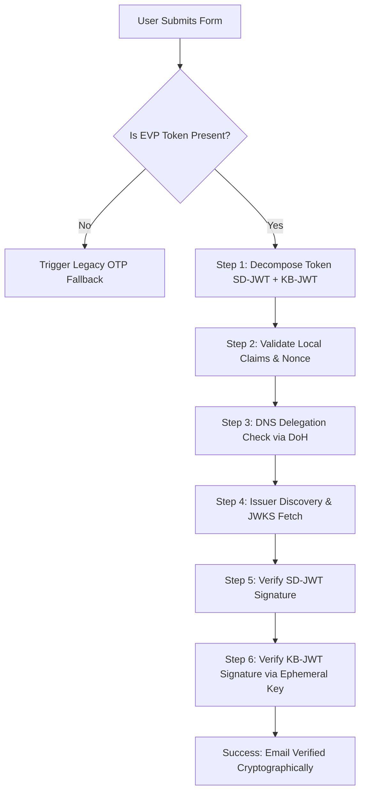

# Email Verification Protocol (EVP) Relying Party Implementation Guide

This guide describes how to implement a fully client-side Email Verification Protocol (EVP) Relying Party (RP) demo. Any AI coding agent can rebuild this entire project using the single prompt provided below.

---

## The Single-Prompt Blueprint

Copy and paste the following prompt into any AI coding agent to build this application from scratch:

```text
Build a client-side Email Verification Protocol (EVP) Relying Party (RP) demo as a single-page web application. The application must verify cryptographically signed Email Verification Tokens (EVTs) in the browser using the "jose" library (loaded via CDN).

Requirements:
1. Tech Stack: Vanilla HTML, vanilla CSS (modern, minimalist, high-contrast dark/light mode dashboard layout resembling Vercel or Linear), and vanilla JS (ES modules).
2. Key features:
   - A Sign-Up Form with an Email input and a hidden input for the EVP token (autofilled by the browser using autocomplete="email-verification-token" and holding a generated session nonce).
   - If the browser does not autofill the token, trigger a fallback flow displaying a legacy OTP/magic-link message.
   - A "Protocol Inspector" card with two tabs:
     - "Verification Trace": Displays the status and inputs/outputs (in collapsible JSON blocks) of each cryptographic step.
     - "Console Logs": A terminal-like scrolling log of the verification process.
3. Cryptographic Verification Steps (must be implemented in JS):
   - Step 1: Decompose the token by splitting at "~" into SD-JWT (issuance token) and KB-JWT (presentation token).
   - Step 2: Validate local claims: verify the email matches the input, audience matches the site origin, nonce matches the session nonce, and the KB-JWT's "sd_hash" matches the SHA-256 hash of the SD-JWT.
   - Step 3: Verify DNS Delegation: if the email domain does not match the issuer domain, perform a DNS TXT lookup using DNS-over-HTTPS (e.g., via https://dns.google/resolve) for `_email-verification.<email_domain>` and verify it contains `iss=<issuer>`.
   - Step 4: Issuer Discovery & JWKS Fetching: fetch the issuer metadata from `<issuer>/.well-known/email-verification` to get the `jwks_uri`, then fetch the public keys. (Include a hardcoded bypass for accounts.google.com to avoid CORS issues).
   - Step 5: Verify Issuer Signature: cryptographically verify the SD-JWT signature using the fetched JWKS keys.
   - Step 6: Verify Ephemeral Key Binding: extract the ephemeral public key from the SD-JWT's "cnf.jwk" claim and use it to verify the KB-JWT signature.
4. UI/UX: Implement a responsive, two-column layout on desktop (Form on left, Protocol Inspector on right) with a clean matte-black/white monochrome design, sharp corners (6px-8px border-radius), and 1px borders.
```

---

## Technical Architecture

The application is structured into three main files:
1. `index.html` — The dashboard layout (two-column).
2. `style.css` — Modern, high-contrast, developer-focused styling (supporting Dark and Light themes).
3. `app.js` — The core cryptographic verification engine.



---

## Detailed Cryptographic Verification Steps

### Step 1: Token Decomposition & Parsing
The incoming token is a string separated by a tilde (`~`):
$$\text{Token} = \text{SD-JWT} \parallel \text{"~"} \parallel \text{KB-JWT}$$
Split the string at the tilde. Parse both tokens as standard JWS strings (header, payload, signature).

### Step 2: Local Claims & Session Binding Verification
Before performing heavy operations, validate the following claims locally:
- **Email Match**: The `email` claim in the SD-JWT payload must match the email entered by the user.
- **Email Verified**: The `email_verified` claim in the SD-JWT must be `true`.
- **Audience Match**: The `aud` claim in the KB-JWT payload must match the Relying Party's origin (e.g., `window.location.origin`).
- **Nonce Match**: The `nonce` claim in the KB-JWT payload must match the session challenge generated when the page loaded.
- **Hash Binding**: Calculate the SHA-256 hash of the SD-JWT string plus the trailing tilde (`SD-JWT + "~"`). This must match the `sd_hash` claim in the KB-JWT.

### Step 3: DNS Delegation Authority Verification
To ensure the issuer is authorized to verify emails for the user's domain:
1. If the email domain (e.g., `gmail.com`) equals the hostname of the issuer (e.g., `accounts.google.com`), skip the DNS check.
2. Otherwise, perform a DNS TXT record query for `_email-verification.<email_domain>` using DNS-over-HTTPS:
   `https://dns.google/resolve?name=_email-verification.<email_domain>&type=TXT`
3. Parse the TXT records. One of the records must contain `iss=<issuer_url>`.

### Step 4: Issuer Discovery & JWKS Fetching
1. Query the issuer's well-known configuration at:
   `https://<issuer_url>/.well-known/email-verification`
2. Extract the `jwks_uri` from the JSON response.
3. Fetch the JSON Web Key Set (JWKS) from `jwks_uri`.
   *(Note: Since some identity providers do not support CORS on these endpoints, you should implement a fallback dictionary mapping well-known issuers directly to their metadata and JWKS endpoints).*

### Step 5: Issuer Signature Cryptographic Verification
Using the keys from the fetched JWKS, verify the signature of the SD-JWT.
- Import the public key using `jose.importJWK`.
- Verify the JWS using `jose.jwtVerify`.

### Step 6: Ephemeral Key Binding Cryptographic Verification
1. Extract the holder's ephemeral public key from the `cnf.jwk` claim in the verified SD-JWT payload.
2. Import this ephemeral public key.
3. Cryptographically verify the signature of the KB-JWT using this key.
4. Successful verification proves the browser has possession of the corresponding private key generated during the session.

---

## File Specifications

### `index.html`
- A `<main class="dashboard">` containing two columns: `.panel-left` and `.panel-right`.
- `.panel-left` contains the sign-up form card and the success/error status banners.
- `.panel-right` contains the `.inspector-card` featuring:
  - Tab buttons: `Verification Trace` and `Console Logs`.
  - `.tab-content` containers that toggle class `.active` via JS.

### `style.css`
- Modern minimalist layout with CSS variables for light/dark themes.
- Solid high-contrast buttons (`#fafafa` background on `#0a0a0a` in dark mode).
- Sharp corners (`border-radius: 6px`) and clear borders (`1px solid var(--card-border)`).
- Custom monospace fonts for logs, JSON trees, and step counters.
- Standard CSS Nesting (`&` selector).

### `app.js`
- Imports `jose` from `https://cdn.jsdelivr.net/npm/jose@5.6.3/+esm`.
- Generates a cryptographically secure 24-byte random nonce on load (`initChallenge()`).
- Implements `verifyEVPToken(token, email)` returning `{ success, email, trace }`.
- Implements tab-switching logic by listening to click events on `.tab-btn` and updating class lists.
