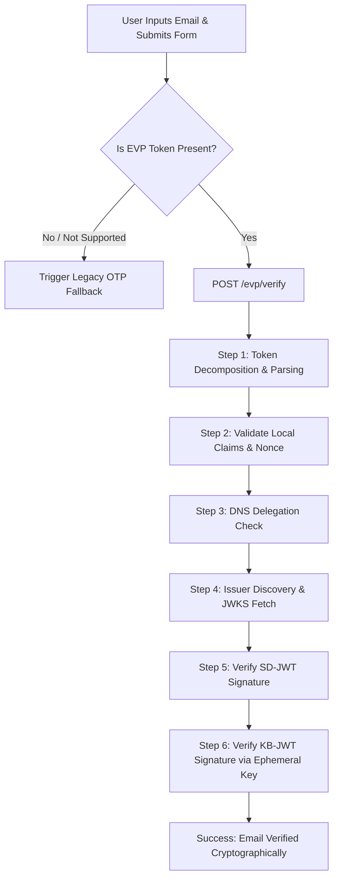

# Email Verification Protocol (EVP) Relying Party - Server-Side Implementation Blueprint (Node.js / Express / TypeScript)

This guide provides a comprehensive blueprint and complete source code to implement a fully functional **Email Verification Protocol (EVP)** Relying Party (RP) demo in a server-side environment (Node.js, Express, and TypeScript).

In a production environment, cryptographic verification of the EVP token **must** happen on the server-side. This prevents clients from bypassing verification by simply tampering with the browser-side JavaScript.

---

## Technical Architecture

The application is structured as a web application where the browser handles the user interaction (autofill, token retrieval, OTP fallback UI, and displaying the trace), and the Node.js server performs the secure cryptographic verification of the submitted token.



### Key Technical Patterns Implemented:
1. **Dynamic Session Nonce**: A cryptographically secure random nonce is generated on the server on page load, rendered in the HTML, and bound to the hidden input.
2. **CSP Nonce Stripping Mitigation**: Modern browsers strip the `nonce="..."` attribute from HTML elements during parsing. The client-side code copies the challenge from a `data-nonce` attribute to the `nonce` attribute dynamically on page load.
3. **Corporate Proxy / Network Hangs Bypass**: Outbound HTTP requests from a local Node.js server (such as fetching Google's well-known configuration or JWKS public keys) can hang or fail on corporate networks. The server includes a hardcoded local map of metadata and public keys for `https://accounts.google.com` to bypass network fetches during local development.
4. **Dynamic Audience Resolution**: In local development, the app might be accessed via `http://localhost:8080`, `http://127.0.0.1:3000`, or `https://rp.localhost` (via a reverse proxy like Caddy). The server dynamically constructs the expected audience from the incoming request's protocol and host, taking proxy headers into account to avoid audience mismatch errors.

---

## Project Structure

Create the following files in your project:

```text
src/
├── client/
│   └── pages/
│       └── evp.ts        # Client-side form & trace rendering
├── server/
│   └── middlewares/
│       ├── evp.ts        # Server-side verification router
│       └── evp.test.ts   # Unit tests for the verification logic
└── shared/
    └── views/
        └── evp.html      # HTML template
```

---

## Source Code

### 1. HTML Template (`src/shared/views/evp.html`)

This template renders the registration form and the **Protocol Inspector** (with a step-by-step cryptographic trace and terminal logs).

```html
<!--
 Copyright 2026 Google Inc. All rights reserved.

 Licensed under the Apache License, Version 2.0 (the "License");
 you may not use this file except in compliance with the License.
 You may obtain a copy of the License at

      https://www.apache.org/licenses/LICENSE-2.0

 Unless required by applicable law or agreed to in writing, software
 distributed under the License is distributed on an "AS IS" BASIS,
 WITHOUT WARRANTIES OR CONDITIONS OF ANY KIND, either express or implied.
 See the License for the specific language governing permissions and
 limitations under the License.
-->

<style>
  .hidden {
    display: none !important;
  }

  .evp-container {
    display: grid;
    grid-template-columns: 1fr;
    gap: 32px;
    width: 100%;
    max-width: 1200px;
    margin: 0 auto;
    padding: 24px 16px;
    align-items: start;
    font-family: Rubik, sans-serif;
  }

  @media (min-width: 992px) {
    .evp-container {
      grid-template-columns: 5fr 7fr;
    }
  }

  .evp-card {
    background: var(--mdui-theme-surface, #fffbfa);
    color: var(--mdui-theme-on-surface, #442c2e);
    border: 1px solid rgba(0, 0, 0, 0.12);
    border-radius: 16px;
    padding: 24px;
    box-shadow: 0 1px 3px rgba(0, 0, 0, 0.05);
  }

  .evp-card h2, .evp-card h3 {
    margin-top: 0;
    margin-bottom: 8px;
    font-weight: 500;
  }

  .evp-card p.subtitle {
    color: #5c5c5c;
    font-size: 14px;
    margin-bottom: 24px;
    line-height: 1.5;
  }

  .form-group {
    display: flex;
    flex-direction: column;
    gap: 8px;
    margin-bottom: 20px;
    width: 100%;
  }

  .form-group label {
    font-size: 14px;
    font-weight: 500;
  }

  .email-input {
    width: 100%;
    padding: 14px 16px;
    border: 1px solid #ccc;
    border-radius: 8px;
    font-size: 16px;
    background-color: #fff;
    color: #000;
    transition: border-color 0.2s;
  }

  .email-input:focus {
    outline: none;
    border-color: var(--mdui-theme-on-surface, #442c2e);
  }

  .submit-btn {
    width: 100%;
    padding: 12px;
    background-color: #1a73e8;
    color: white;
    border: none;
    border-radius: 100px;
    font-size: 14px;
    font-weight: 500;
    cursor: pointer;
    display: flex;
    align-items: center;
    justify-content: center;
    height: 44px;
    transition: background-color 0.2s;
  }

  .submit-btn:hover {
    background-color: #1557b0;
  }

  .submit-btn:disabled {
    background-color: #ccc;
    cursor: not-allowed;
  }

  /* Status Banners */
  .status-banner {
    display: flex;
    gap: 12px;
    padding: 16px;
    border-radius: 12px;
    margin-top: 24px;
    border: 1px solid transparent;
  }

  .status-banner.success {
    background-color: #e6f4ea;
    border-color: #82c396;
    color: #137333;
  }

  .status-banner.error {
    background-color: #fce8e6;
    border-color: #f5adad;
    color: #c5221f;
  }

  .status-banner h4 {
    margin: 0 0 4px 0;
    font-size: 15px;
    font-weight: 500;
  }

  .status-banner p {
    margin: 0;
    font-size: 13px;
    line-height: 1.4;
  }

  .verified-badge {
    display: inline-block;
    background: rgba(0, 0, 0, 0.04);
    padding: 4px 8px;
    border-radius: 4px;
    font-size: 12px;
    font-family: monospace;
    margin-top: 8px;
    border: 1px solid rgba(0, 0, 0, 0.08);
  }

  /* OTP Fallback */
  .otp-container {
    margin-top: 24px;
    padding: 20px;
    border: 1px solid #cfd9d2;
    border-radius: 12px;
    background: #fff;
  }

  /* Protocol Inspector */
  .inspector-header {
    display: flex;
    justify-content: space-between;
    align-items: center;
    border-bottom: 1px solid rgba(0, 0, 0, 0.12);
    padding-bottom: 12px;
    margin-bottom: 16px;
  }

  .inspector-title-group {
    display: flex;
    align-items: center;
    gap: 12px;
  }

  .status-badge {
    padding: 2px 8px;
    border-radius: 4px;
    font-size: 11px;
    font-weight: 500;
    text-transform: uppercase;
    letter-spacing: 0.5px;
    border: 1px solid transparent;
  }

  .status-badge.idle {
    background: #f1f3f4;
    color: #5f6368;
  }

  .status-badge.verifying {
    background: #e8f0fe;
    color: #1a73e8;
    border-color: #1a73e8;
  }

  .status-badge.verified {
    background: #e6f4ea;
    color: #137333;
    border-color: #137333;
  }

  .status-badge.failed {
    background: #fce8e6;
    color: #c5221f;
    border-color: #c5221f;
  }

  .tab-navigation {
    display: flex;
    gap: 16px;
  }

  .tab-btn {
    background: transparent;
    border: none;
    border-bottom: 2px solid transparent;
    color: #5f6368;
    padding: 6px 0;
    font-size: 12px;
    font-weight: 500;
    cursor: pointer;
    text-transform: uppercase;
    letter-spacing: 0.5px;
  }

  .tab-btn.active {
    color: var(--mdui-theme-on-surface, #442c2e);
    border-bottom-color: var(--mdui-theme-on-surface, #442c2e);
  }

  .tab-content {
    display: none;
  }

  .tab-content.active {
    display: block;
  }

  /* Trace Steps */
  .trace-placeholder {
    border: 1px dashed rgba(0, 0, 0, 0.12);
    border-radius: 8px;
    padding: 64px 16px;
    text-align: center;
    color: #5f6368;
    font-size: 14px;
  }

  .trace-step {
    border: 1px solid rgba(0, 0, 0, 0.12);
    border-radius: 8px;
    margin-bottom: 8px;
    overflow: hidden;
    background: rgba(0, 0, 0, 0.01);
  }

  .trace-step-header {
    padding: 12px 16px;
    display: flex;
    justify-content: space-between;
    align-items: center;
    cursor: pointer;
    user-select: none;
  }

  .trace-step-header:hover {
    background: rgba(0, 0, 0, 0.03);
  }

  .trace-step-title {
    display: flex;
    align-items: center;
    gap: 8px;
  }

  .step-num {
    font-family: monospace;
    font-size: 12px;
    color: #5f6368;
  }

  .step-name {
    font-size: 14px;
    font-weight: 500;
  }

  .step-status {
    font-size: 11px;
    font-weight: 500;
    text-transform: uppercase;
  }

  .step-status.pending { color: #5f6368; }
  .step-status.success { color: #137333; }
  .step-status.failed { color: #c5221f; }

  .trace-step-body {
    padding: 16px;
    border-top: 1px solid rgba(0, 0, 0, 0.12);
    background: #fff;
    display: none;
  }

  .trace-step-body.open {
    display: block;
  }

  .step-desc {
    color: #5c5c5c;
    font-size: 13px;
    line-height: 1.5;
    margin-bottom: 12px;
  }

  .json-toggle {
    background: transparent;
    border: 1px solid rgba(0, 0, 0, 0.12);
    color: #5f6368;
    padding: 4px 8px;
    border-radius: 4px;
    font-size: 11px;
    font-weight: 500;
    cursor: pointer;
    display: inline-flex;
    align-items: center;
    gap: 4px;
  }

  .json-details {
    margin-top: 8px;
  }

  .json-label {
    font-size: 10px;
    font-weight: 500;
    color: #5f6368;
    text-transform: uppercase;
    margin-top: 8px;
    margin-bottom: 2px;
  }

  .json-data {
    background: #f8f9fa;
    border: 1px solid rgba(0, 0, 0, 0.08);
    border-radius: 4px;
    padding: 8px;
    font-family: monospace;
    font-size: 11px;
    overflow-x: auto;
    color: #3c4043;
    max-height: 150px;
    margin: 0;
  }

  /* Console Terminal */
  .console-log {
    background-color: #1e1e1e;
    color: #f1f1f1;
    padding: 16px;
    font-family: monospace;
    font-size: 12px;
    line-height: 1.5;
    height: 400px;
    overflow-y: auto;
    border-radius: 8px;
    display: flex;
    flex-direction: column;
    gap: 4px;
  }

  .console-line {
    word-break: break-all;
    white-space: pre-wrap;
  }

  .console-line .timestamp {
    color: #858585;
    margin-right: 8px;
  }

  .console-line.system { color: #75beff; }
  .console-line.success { color: #4ec9b0; }
  .console-line.error { color: #f48771; }
  .console-line.highlight { color: #cca700; }
</style>

<div class="evp-container">
  <!-- Left Column: Form & Flow -->
  <div class="panel-left">
    <div class="evp-card">
      <div id="email-form-container">
        <h2>Sign In</h2>
        <p class="subtitle">
          Select your email address from the autofill dropdown to verify it instantly.
        </p>

        <!-- Prerequisites Info Box -->
        <div style="background-color: #f1f3f4; border-left: 4px solid #1a73e8; padding: 12px 16px; border-radius: 4px; margin-bottom: 20px; font-size: 13px; line-height: 1.5; color: #3c4043; text-align: left;">
          <strong>Prerequisites for testing:</strong>
          <ul style="margin: 6px 0 0 0; padding-left: 20px;">
            <li>Use <strong>Chrome Canary</strong> or Dev channel.</li>
            <li>Enable the flag: <code style="background: #e8eaed; padding: 2px 4px; border-radius: 4px; font-family: monospace; font-size: 11px;">chrome://flags/#email-verification-protocol</code></li>
            <li>Ensure you are logged in to your Google Account (Gmail) in this browser profile.</li>
          </ul>
        </div>

        <form id="evp-form">
          <div class="form-group">
            <label for="email">Email Address</label>
            <input
              type="email"
              name="email"
              id="email"
              autocomplete="email"
              required
              class="email-input"
              placeholder="Select from autofill..."
            />
          </div>

          <!-- Hidden input for the EVP token -->
          <input
            type="hidden"
            name="evt"
            id="evt"
            data-nonce="{{nonce}}"
            autocomplete="email-verification-token"
          />

          <button type="submit" class="submit-btn" id="submit-btn">
            Sign up
          </button>
        </form>
      </div>

      <!-- OTP Fallback Container (Initially Hidden) -->
      <div id="otp-fallback-container" class="hidden">
        <div class="otp-container">
          <h3 style="color: #c5221f;">EVP Token Not Found</h3>
          <p class="subtitle" style="margin-bottom: 16px;">
            We did not receive a cryptographic verification token for <strong id="fallback-email-display"></strong>. 
            We have fallen back to simulating a traditional 6-digit verification code.
          </p>
          <form id="otp-form" style="display: flex; flex-direction: column; gap: 16px;">
            <div class="form-group" style="margin-bottom: 0;">
              <label for="otp">One-time code</label>
              <input
                type="text"
                id="otp"
                name="otp"
                inputmode="numeric"
                pattern="[0-9]{6}"
                maxlength="6"
                required
                class="email-input"
                placeholder="123456"
              />
            </div>
            <div style="display: flex; gap: 12px; width: 100%;">
              <button type="submit" class="submit-btn" style="flex: 1;">Verify code</button>
              <button type="button" id="otp-cancel-btn" class="submit-btn" style="background: transparent; border: 1px solid #ccc; color: #333; flex: 1;">Cancel</button>
            </div>
          </form>
        </div>
      </div>

      <!-- Status Banners -->
      <div id="success-banner" class="status-banner success hidden">
        <div>🎉</div>
        <div>
          <h4>Email Verified!</h4>
          <p>Verified cryptographically. No verification email was sent.</p>
          <div class="verified-badge">
            Identity: <strong id="verified-email-text">-</strong>
          </div>
        </div>
      </div>

      <div id="error-banner" class="status-banner error hidden">
        <div>❌</div>
        <div>
          <h4>Verification Failed</h4>
          <p id="error-message-text">The cryptographic token could not be verified.</p>
        </div>
      </div>
    </div>
  </div>

  <!-- Right Column: Protocol Inspector -->
  <div class="panel-right">
    <div class="evp-card">
      <div class="inspector-header">
        <div class="inspector-title-group">
          <h3>Protocol Inspector</h3>
          <span class="status-badge idle" id="overall-status">Idle</span>
        </div>
        <div class="tab-navigation">
          <button class="tab-btn active" data-tab="trace">Verification Trace</button>
          <button class="tab-btn" data-tab="logs">Console Logs</button>
        </div>
      </div>

      <!-- Tab 1: Verification Trace -->
      <div class="tab-content active" id="tab-trace">
        <div class="trace-steps" id="trace-steps-list">
          <div class="trace-placeholder">
            Submit the form to view the cryptographic trace steps.
          </div>
        </div>
      </div>

      <!-- Tab 2: Console Logs -->
      <div class="tab-content" id="tab-logs">
        <div class="console-log" id="console-log-terminal">
          <div class="console-line system">Ready. Select your email from the autofill dropdown to begin.</div>
        </div>
      </div>
    </div>
  </div>
</div>
```

---

### 2. Client-side Controller (`src/client/pages/evp.ts`)

This TypeScript file manages the frontend interactions. It retrieves the EVP token populated by the browser, submits it to the server for verification, and renders the JSON verification traces.

```typescript
/*
 * @license
 * Copyright 2026 Google Inc. All rights reserved.
 *
 * Licensed under the Apache License, Version 2.0 (the "License");
 * you may not use this file except in compliance with the License.
 * You may obtain a copy of the License at
 *
 *     https://www.apache.org/licenses/LICENSE-2.0
 *
 * Unless required by applicable law or agreed to in writing, software
 * distributed under the License is distributed on an "AS IS" BASIS,
 * WITHOUT WARRANTIES OR CONDITIONS OF ANY KIND, either express or implied.
 * See the License for the specific language governing permissions and
 * limitations under the License
 */

// Helper utility to select elements
const $ = (selector: string) => document.querySelector(selector) as HTMLElement;

// Helper to make POST request
async function post(url: string, data: any) {
  const response = await fetch(url, {
    method: 'POST',
    headers: { 'Content-Type': 'application/json' },
    body: JSON.stringify(data),
  });
  if (!response.ok) {
    throw new Error(`HTTP error! Status: ${response.status}`);
  }
  return response.json();
}

document.addEventListener('DOMContentLoaded', () => {
  const emailFormContainer = $('#email-form-container') as HTMLDivElement;
  const evpForm = $('#evp-form') as HTMLFormElement;
  const emailInput = $('#email') as HTMLInputElement;
  const tokenInput = $('#evt') as HTMLInputElement;
  const submitBtn = $('#submit-btn') as HTMLButtonElement;

  const otpFallbackContainer = $('#otp-fallback-container') as HTMLDivElement;
  const fallbackEmailDisplay = $('#fallback-email-display') as HTMLSpanElement;
  const otpForm = $('#otp-form') as HTMLFormElement;
  const otpInput = $('#otp') as HTMLInputElement;
  const otpCancelBtn = $('#otp-cancel-btn') as HTMLElement;

  const successBanner = $('#success-banner') as HTMLDivElement;
  const verifiedEmailText = $('#verified-email-text') as HTMLSpanElement;
  const errorBanner = $('#error-banner') as HTMLDivElement;
  const errorMessageText = $('#error-message-text') as HTMLSpanElement;

  const overallStatus = $('#overall-status') as HTMLSpanElement;
  const traceStepsList = $('#trace-steps-list') as HTMLDivElement;
  const consoleLogTerminal = $('#console-log-terminal') as HTMLDivElement;

  // Set the nonce attribute dynamically to prevent the browser from stripping it during HTML parsing
  const nonce = tokenInput.getAttribute('data-nonce');
  if (nonce) {
    tokenInput.setAttribute('nonce', nonce);
    logToTerminal(
      `Local session challenge (nonce) bound to input: ${nonce}`,
      'system'
    );
  }

  // Set up tab navigation
  const tabButtons = document.querySelectorAll('.tab-btn');
  tabButtons.forEach(btn => {
    btn.addEventListener('click', () => {
      const targetTab = btn.getAttribute('data-tab');
      if (!targetTab) return;

      document
        .querySelectorAll('.tab-btn')
        .forEach(b => b.classList.remove('active'));
      document
        .querySelectorAll('.tab-content')
        .forEach(c => c.classList.remove('active'));

      btn.classList.add('active');
      const targetContent = $(`#tab-${targetTab}`);
      if (targetContent) {
        targetContent.classList.add('active');
      }
    });
  });

  // Handle main EVP form submission
  evpForm.addEventListener('submit', async event => {
    event.preventDefault();

    const email = emailInput.value.trim();
    const evt = tokenInput.value.trim();

    // Reset UI
    successBanner.classList.add('hidden');
    errorBanner.classList.add('hidden');
    otpFallbackContainer.classList.add('hidden');
    traceStepsList.innerHTML = '';
    consoleLogTerminal.innerHTML = '';

    logToTerminal(
      'Form submitted. Checking for browser-populated EVP token...',
      'system'
    );

    if (!evt) {
      logToTerminal(
        'EVP token NOT found in hidden input. Falling back to OTP flow.',
        'highlight'
      );
      setOverallStatus('failed', 'No EVP Token');

      emailFormContainer.classList.add('hidden');
      otpFallbackContainer.classList.remove('hidden');
      fallbackEmailDisplay.innerText = email;
      renderFallbackTrace(email);
      return;
    }

    logToTerminal(
      'EVP token found! Initiating server-side cryptographic verification...',
      'success'
    );
    logToTerminal(`Token: ${evt}`);
    setOverallStatus('verifying', 'Verifying...');
    submitBtn.disabled = true;

    try {
      const result = await post('/evp/verify', {email, evt});

      submitBtn.disabled = false;
      renderTrace(result.steps);

      if (result.success) {
        logToTerminal(
          'Verification succeeded! Email ownership cryptographically verified.',
          'success'
        );
        setOverallStatus('verified', 'Verified');
        successBanner.classList.remove('hidden');
        verifiedEmailText.innerText = result.verifiedEmail;
      } else {
        logToTerminal(`Verification failed: ${result.error}`, 'error');
        setOverallStatus('failed', 'Failed');
        errorBanner.classList.remove('hidden');
        errorMessageText.innerText =
          result.error || 'Cryptographic verification failed.';
      }
    } catch (e: any) {
      submitBtn.disabled = false;
      logToTerminal(
        `Server error during verification: ${e.message || e}`,
        'error'
      );
      setOverallStatus('failed', 'Error');
      errorBanner.classList.remove('hidden');
      errorMessageText.innerText =
        e.message || 'An unexpected server error occurred.';
    }
  });

  // Handle OTP fallback submission
  otpForm.addEventListener('submit', event => {
    event.preventDefault();
    const email = emailInput.value.trim();
    const otp = otpInput.value.trim();

    if (!/^\d{6}$/.test(otp)) {
      logToTerminal('Invalid OTP format. Must be a 6-digit number.', 'error');
      return;
    }

    logToTerminal(`Simulating OTP verification for code: ${otp}...`, 'system');
    logToTerminal('OTP verified successfully!', 'success');

    otpFallbackContainer.classList.add('hidden');
    successBanner.classList.remove('hidden');
    verifiedEmailText.innerText = `${email} (verified via OTP fallback)`;
    setOverallStatus('verified', 'Verified (OTP)');
  });

  // Handle OTP Cancel button
  otpCancelBtn.addEventListener('click', () => {
    otpFallbackContainer.classList.add('hidden');
    emailFormContainer.classList.remove('hidden');
    setOverallStatus('idle', 'Idle');
    traceStepsList.innerHTML =
      '<div class="trace-placeholder">Submit the form to view the cryptographic trace steps.</div>';
    logToTerminal('Returned to email registration screen.', 'system');
  });

  /* Helper Functions */
  function logToTerminal(
    message: string,
    type: 'system' | 'success' | 'error' | 'highlight' | '' = ''
  ) {
    const lineEl = document.createElement('div');
    lineEl.className = `console-line ${type}`;

    const timestamp = document.createElement('span');
    timestamp.className = 'timestamp';
    timestamp.textContent = `[${new Date().toLocaleTimeString()}]`;

    lineEl.appendChild(timestamp);
    lineEl.appendChild(document.createTextNode(` ${message}`));
    consoleLogTerminal.appendChild(lineEl);
    consoleLogTerminal.scrollTop = consoleLogTerminal.scrollHeight;
  }

  function setOverallStatus(
    statusClass: 'idle' | 'verifying' | 'verified' | 'failed',
    text: string
  ) {
    overallStatus.className = `status-badge ${statusClass}`;
    overallStatus.innerText = text;
  }

  function renderTrace(steps: any) {
    traceStepsList.innerHTML = '';

    const stepMetadata = [
      {
        num: 1,
        name: 'Token Decomposition & Parsing',
        desc: 'Decompose the submitted token into its distinct EVT and Key Binding JWT (KB-JWT) components, and perform local decoding of their headers and payloads.',
      },
      {
        num: 2,
        name: 'Local Claims & Session Binding',
        desc: 'Verify local, non-cryptographic claims (email match, verification status, audience, nonce, and cryptographic hash binding) to fail fast before doing network or crypto operations.',
      },
      {
        num: 3,
        name: 'DNS Delegation Authority',
        desc: "Perform dynamic server-side DNS queries to confirm that the email's domain delegated verification authority to the token issuer.",
      },
      {
        num: 4,
        name: 'Issuer Discovery & JWKS Fetching',
        desc: "Fetch the issuer's well-known configuration and JWKS public keys from their authoritative origin.",
      },
      {
        num: 5,
        name: 'Issuer Signature Cryptographic Verification',
        desc: 'Cryptographically verify the EVT signature using the fetched issuer public keys from their JWKS.',
      },
      {
        num: 6,
        name: 'Ephemeral Key Binding Verification',
        desc: "Extract the browser's ephemeral public key from the validated EVT and cryptographically verify the KB-JWT signature to prove possession of the private key.",
      },
    ];

    stepMetadata.forEach(meta => {
      const stepKey = `step${meta.num}`;
      const stepData = steps[stepKey];
      if (!stepData) return;

      const stepEl = document.createElement('div');
      stepEl.className = `trace-step`;

      const headerEl = document.createElement('div');
      headerEl.className = 'trace-step-header';
      headerEl.innerHTML = `
        <div class="trace-step-title">
          <span class="step-num">${meta.num}</span>
          <span class="step-name">${escapeHtml(meta.name)}</span>
        </div>
        <span class="step-status ${stepData.status}">${stepData.status}</span>
      `;

      const bodyEl = document.createElement('div');
      bodyEl.className = 'trace-step-body';
      bodyEl.innerHTML = `
        <p class="step-desc">${escapeHtml(meta.desc)}</p>
        <div class="json-box-container">
          <button class="json-toggle">
            <span>Show Input / Output Data Traces</span>
            <span class="arrow">▼</span>
          </button>
          <div class="json-details hidden">
            <div class="json-label">Inputs Sent:</div>
            <pre class="json-data">${escapeHtml(JSON.stringify(stepData.inputs, null, 2))}</pre>
            <div class="json-label">Outputs Received:</div>
            <pre class="json-data">${escapeHtml(JSON.stringify(stepData.outputs, null, 2))}</pre>
          </div>
        </div>
      `;

      headerEl.addEventListener('click', () => {
        bodyEl.classList.toggle('open');
      });

      const jsonToggle = bodyEl.querySelector(
        '.json-toggle'
      ) as HTMLButtonElement;
      const jsonDetails = bodyEl.querySelector(
        '.json-details'
      ) as HTMLDivElement;
      const arrow = bodyEl.querySelector('.arrow') as HTMLSpanElement;

      jsonToggle.addEventListener('click', e => {
        e.stopPropagation();
        jsonDetails.classList.toggle('hidden');
        arrow.textContent = jsonDetails.classList.contains('hidden')
          ? '▼'
          : '▲';
      });

      stepEl.appendChild(headerEl);
      stepEl.appendChild(bodyEl);
      traceStepsList.appendChild(stepEl);

      // Log steps to terminal as they render
      const logType = stepData.status === 'success' ? 'success' : 'error';
      logToTerminal(
        `Step ${meta.num} (${meta.name}): ${stepData.status.toUpperCase()}`,
        logType
      );
    });
  }

  function renderFallbackTrace(email: string) {
    traceStepsList.innerHTML = `
      <div class="trace-step">
        <div class="trace-step-header" style="cursor: default;">
          <div class="trace-step-title">
            <span class="step-num">1</span>
            <span class="step-name">EVP Token Check</span>
          </div>
          <span class="step-status failed">missing</span>
        </div>
        <div class="trace-step-body open" style="display: block;">
          <p class="step-desc">The browser did not populate the <code>email-verification-token</code> hidden input. Falling back to OTP.</p>
        </div>
      </div>
      <div class="trace-step">
        <div class="trace-step-header" style="cursor: default;">
          <div class="trace-step-title">
            <span class="step-num">2</span>
            <span class="step-name">OTP Fallback Triggered</span>
          </div>
          <span class="step-status success">triggered</span>
        </div>
        <div class="trace-step-body open" style="display: block;">
          <p class="step-desc">A simulated 6-digit verification code has been dispatched to <code>${escapeHtml(email)}</code>.</p>
        </div>
      </div>
    `;
  }

  function escapeHtml(str: string): string {
    return str
      .replace(/&/g, '&amp;')
      .replace(/</g, '&lt;')
      .replace(/>/g, '&gt;')
      .replace(/"/g, '&quot;')
      .replace(/'/g, '&#39;');
  }
});
```

---

### 3. Express verification Router (`src/server/middlewares/evp.ts`)

This is the Express router that performs the cryptographic verification on the server side. It handles parsing, claims verification, DNS delegation check (via Node's `node:dns`), JWKS fetching, and signature checks using Node's native `node:crypto` module.

> [!NOTE]
> This code is fully adapted to be standalone. If you are using a standard Express session, the `expectedNonce` should be retrieved from `req.session.challenge` (using standard middleware like `express-session`).

```typescript
import { Router, Request, Response } from 'express';
import dns from 'node:dns/promises';
import crypto from 'node:crypto';

// In-memory bypass dictionary for accounts.google.com during local development
const WELL_KNOWN_ISSUERS: Record<
  string,
  {
    metadata: any;
    jwks: any;
  }
> = {
  'https://accounts.google.com': {
    metadata: {
      issuance_endpoint:
        'https://accounts.google.com/gsi/email-verification/issue',
      jwks_uri:
        'https://verifiablecredentials-pa.googleapis.com/.well-known/vc-public-jwks',
      signing_alg_values_supported: ['EdDSA'],
    },
    jwks: {
      keys: [
        {
          key_ops: ['verify'],
          crv: 'Ed25519',
          use: 'sig',
          x: 'GuNteO__TGPZ6Cg_QAkHaAgeVsxjevVjnCOQhEtihP8',
          alg: 'EdDSA',
          kty: 'OKP',
        },
        {
          crv: 'Ed25519',
          key_ops: ['verify'],
          use: 'sig',
          x: 's67dqUq-JC_3eqZzxM7O2hfSrlr8zU-mJppb-GDH0a0',
          alg: 'EdDSA',
          kty: 'OKP',
        },
        {
          key_ops: ['verify'],
          crv: 'Ed25519',
          use: 'sig',
          x: 'YLc8EhrIA5eCj7501gSxdgYk0_NSKqkf83aVLBH5y-Y',
          alg: 'EdDSA',
          kty: 'OKP',
        },
        {
          kty: 'OKP',
          alg: 'EdDSA',
          x: 'ETW0l_0paWEjHBGvZ70Ljs3IAXaZvqU4nWSA0UbvBuI',
          key_ops: ['verify'],
          crv: 'Ed25519',
          use: 'sig',
        },
        {
          alg: 'EdDSA',
          kty: 'OKP',
          crv: 'Ed25519',
          key_ops: ['verify'],
          use: 'sig',
          x: 'dCCZZmy3Zuy8R8i0ed0GEa0Hhqum2OrhR1lJ7x4vN_E',
        },
      ],
    },
  },
};

const router = Router();

interface DecodedJwt {
  header: any;
  payload: any;
  parts: string[];
}

// Decodes standard JWT base64url parts
function decodeJwt(jwtString: string): DecodedJwt {
  const parts = jwtString.split('.');
  if (parts.length < 2) {
    throw new Error('Invalid JWT format');
  }
  const header = JSON.parse(
    Buffer.from(parts[0], 'base64url').toString('utf8')
  );
  const payload = JSON.parse(
    Buffer.from(parts[1], 'base64url').toString('utf8')
  );
  return { header, payload, parts };
}

/**
 * Route: GET /evp
 * Renders the form and initializes the session challenge (nonce)
 */
router.get('/', (req: Request, res: Response) => {
  // Generate a cryptographically secure 24-byte random string for the session challenge
  const nonce = crypto.randomBytes(24).toString('base64url');
  
  // Store the challenge in session
  if (req.session) {
    (req.session as any).challenge = nonce;
  }
  
  res.render('evp.html', {
    title: 'EVP Verifier',
    nonce,
  });
});

/**
 * Route: POST /evp/verify
 * Cryptographically verifies the EVP token sent by the browser
 */
router.post('/verify', async (req: Request, res: Response): Promise<void> => {
  const { email, evt } = req.body;

  if (!email || !evt) {
    res.status(400).json({ error: 'Missing email or token (evt)' });
    return;
  }

  // Retrieve the expected session challenge (nonce)
  const expectedNonce = req.session ? (req.session as any).challenge : null;

  // Initialize a trace steps dictionary to return details of the verification
  const steps: any = {
    step1: { status: 'pending', inputs: {}, outputs: {} },
    step2: { status: 'pending', inputs: {}, outputs: {} },
    step3: { status: 'pending', inputs: {}, outputs: {} },
    step4: { status: 'pending', inputs: {}, outputs: {} },
    step5: { status: 'pending', inputs: {}, outputs: {} },
    step6: { status: 'pending', inputs: {}, outputs: {} },
  };

  let success = false;
  let errorMsg = '';
  let verifiedEmail = '';

  try {
    // =========================================================================
    // Step 1: Token Decomposition & Parsing
    // =========================================================================
    steps.step1.inputs = { rawToken: evt };
    const evtParts = evt.split('~');
    if (evtParts.length !== 2) {
      throw new Error(
        'Invalid token format: Expected [SD-JWT_Issuance_Token]~[KB-JWT_Presentation_Token]'
      );
    }
    const [sdJwtString, kbJwtString] = evtParts;

    const decodedEvt = decodeJwt(sdJwtString);
    const decodedKb = decodeJwt(kbJwtString);

    steps.step1.outputs = {
      evtHeader: decodedEvt.header,
      evtPayload: decodedEvt.payload,
      kbHeader: decodedKb.header,
      kbPayload: decodedKb.payload,
    };
    steps.step1.status = 'success';

    // =========================================================================
    // Step 2: Local Claims & Session Binding Verification
    // =========================================================================
    const tokenEmail = decodedEvt.payload.email;
    const emailVerifiedClaim = decodedEvt.payload.email_verified;
    const tokenAudience = decodedKb.payload.aud;
    const tokenNonce = decodedKb.payload.nonce;
    const tokenHash = decodedKb.payload.sd_hash;

    // The sd_hash is the SHA-256 hash of the SD-JWT (including the trailing tilde)
    const calculatedEvtHash = crypto
      .createHash('sha256')
      .update(sdJwtString + '~')
      .digest('base64url');

    // Dynamically resolve audience to support local proxies / ports
    const protocol = (req.headers['x-forwarded-proto'] as string) || req.protocol;
    const host = (req.headers['x-forwarded-host'] as string) || req.get('host') || '';
    const expectedAudience = `${protocol}://${host}`;

    steps.step2.inputs = {
      submittedEmail: email,
      tokenEmail,
      emailVerifiedClaim,
      expectedAudience,
      tokenAudience,
      expectedNonce,
      tokenNonce,
      calculatedEvtHash,
      tokenHash,
    };

    if (
      !email ||
      email.trim().toLowerCase() !== tokenEmail.trim().toLowerCase()
    ) {
      throw new Error(
        `Email mismatch: Submitted "${email}", Token contained "${tokenEmail}"`
      );
    }
    if (emailVerifiedClaim !== true) {
      throw new Error('Email verified claim is not true.');
    }

    const expectedHost = new URL(expectedAudience).host;
    const tokenHost = new URL(tokenAudience).host;
    if (expectedHost !== tokenHost) {
      throw new Error(
        `Audience mismatch: Expected "${expectedAudience}", Token contained "${tokenAudience}"`
      );
    }

    if (expectedNonce && tokenNonce !== expectedNonce) {
      throw new Error(
        `Nonce mismatch: Expected "${expectedNonce}", Token contained "${tokenNonce}"`
      );
    }

    if (calculatedEvtHash !== tokenHash) {
      throw new Error(
        `Hash binding mismatch: Calculated "${calculatedEvtHash}", Token contained "${tokenHash}"`
      );
    }

    steps.step2.outputs = { localChecksPassed: true };
    steps.step2.status = 'success';

    // =========================================================================
    // Step 3: DNS Delegation Authority Verification
    // =========================================================================
    const tokenIssuer = decodedEvt.payload.iss;
    const emailDomain = email.split('@')[1];
    const dnsLookupTarget = `_email-verification.${emailDomain}`;

    steps.step3.inputs = {
      submittedEmail: email,
      tokenIssuer,
      dnsLookupTarget,
    };

    let isDelegated = false;
    let authorizedBy = '';

    const issuerUrl = new URL(tokenIssuer);
    const issuerHost = issuerUrl.hostname;

    // If issuer domain matches email domain, delegation is implicit
    if (emailDomain.toLowerCase() === issuerHost.toLowerCase()) {
      isDelegated = true;
      authorizedBy = 'Direct Domain Equality (Self-Authoritative)';
    } else {
      let dnsTxtRecords: string[][] = [];
      try {
        dnsTxtRecords = await dns.resolveTxt(dnsLookupTarget);
      } catch (e: any) {
        console.error(`DNS lookup failed for ${dnsLookupTarget}:`, e);
      }

      isDelegated = dnsTxtRecords.some(record =>
        record.some(str => str.includes(`iss=${issuerHost}`))
      );
      authorizedBy = 'DNS TXT Record Delegation';
    }

    if (!isDelegated) {
      throw new Error(
        `Domain ${emailDomain} has not delegated verification authority to issuer ${tokenIssuer}`
      );
    }

    steps.step3.outputs = { authorizedBy };
    steps.step3.status = 'success';

    // =========================================================================
    // Step 4: Issuer Discovery & JWKS Fetching
    // =========================================================================
    const discoveryUrl = `${tokenIssuer}/.well-known/email-verification`;
    steps.step4.inputs = { url: discoveryUrl };

    let issuerMetadata: any;
    let issuerJWKS: any;

    const knownIssuer = WELL_KNOWN_ISSUERS[tokenIssuer];
    // Use hardcoded local issuer metadata and JWKS in local development to bypass proxy failures
    if (knownIssuer && process.env.NODE_ENV !== 'production') {
      issuerMetadata = knownIssuer.metadata;
      issuerJWKS = knownIssuer.jwks;
      steps.step4.outputs = {
        message:
          '[LOCAL BYPASS] Used local metadata and JWKS to avoid corporate network proxy blocks',
        issuerMetadata,
        issuerJWKS,
      };
    } else {
      // Fetch well-known config from the Identity Provider (IdP)
      const wellKnownRes = await fetch(discoveryUrl);
      if (!wellKnownRes.ok) {
        throw new Error(
          `Failed to fetch issuer metadata from ${discoveryUrl}`
        );
      }
      issuerMetadata = await wellKnownRes.json();

      // Fetch JWKS
      const jwksRes = await fetch(issuerMetadata.jwks_uri);
      if (!jwksRes.ok) {
        throw new Error(
          `Failed to fetch JWKS from ${issuerMetadata.jwks_uri}`
        );
      }
      issuerJWKS = await jwksRes.json();

      steps.step4.outputs = {
        issuerMetadata,
        issuerJWKS,
      };
    }
    steps.step4.status = 'success';

    // =========================================================================
    // Step 5: Issuer Signature Cryptographic Verification
    // =========================================================================
    steps.step5.inputs = {
      signingAlg: decodedEvt.header.alg || 'EdDSA',
      kid: decodedEvt.header.kid,
    };

    const kid = decodedEvt.header.kid;
    const signingInput = `${decodedEvt.parts[0]}.${decodedEvt.parts[1]}`;
    const data = Buffer.from(signingInput, 'utf8');
    const signature = Buffer.from(decodedEvt.parts[2], 'base64url');

    const keysToTry = kid
      ? issuerJWKS.keys.filter((k: any) => k.kid === kid)
      : issuerJWKS.keys;

    let signatureVerified = false;
    for (const jwk of keysToTry) {
      try {
        const publicKey = crypto.createPublicKey({ format: 'jwk', key: jwk });
        signatureVerified = crypto.verify(
          undefined,
          data,
          publicKey,
          signature
        );
        if (signatureVerified) {
          steps.step5.outputs = { verifiedKey: jwk };
          break;
        }
      } catch (e) {
        // Continue trying other keys
      }
    }

    if (!signatureVerified) {
      throw new Error(
        'Failed to verify SD-JWT signature against issuer public keys'
      );
    }
    steps.step5.status = 'success';

    // =========================================================================
    // Step 6: Ephemeral Key Binding Cryptographic Verification
    // =========================================================================
    const ephemeralPublicKey = decodedEvt.payload.cnf?.jwk;
    if (!ephemeralPublicKey) {
      throw new Error(
        'Missing ephemeral key binding (cnf.jwk) in SD-JWT payload'
      );
    }

    steps.step6.inputs = {
      cnf: decodedEvt.payload.cnf,
      kbJwt: kbJwtString,
    };

    const kbSigningInput = `${decodedKb.parts[0]}.${decodedKb.parts[1]}`;
    const kbData = Buffer.from(kbSigningInput, 'utf8');
    const kbSignature = Buffer.from(decodedKb.parts[2], 'base64url');

    let kbSignatureVerified = false;
    try {
      const kbPublicKey = crypto.createPublicKey({
        format: 'jwk',
        key: ephemeralPublicKey,
      });
      kbSignatureVerified = crypto.verify(
        undefined,
        kbData,
        kbPublicKey,
        kbSignature
      );
    } catch (e: any) {
      throw new Error(`Failed to import ephemeral public key: ${e.message}`);
    }

    if (!kbSignatureVerified) {
      throw new Error(
        'Failed to verify KB-JWT signature using ephemeral public key'
      );
    }

    steps.step6.outputs = { keyBindingPassed: true };
    steps.step6.status = 'success';

    success = true;
    verifiedEmail = tokenEmail;
  } catch (error: any) {
    console.error('EVP Verification error:', error);
    errorMsg = error.message || 'Verification failed';

    // Determine which step failed to mark it in the trace
    for (let i = 1; i <= 6; i++) {
      const stepKey = `step${i}`;
      if (steps[stepKey].status === 'pending') {
        steps[stepKey].status = 'failed';
        steps[stepKey].outputs = { error: errorMsg };
        break;
      }
    }
  }

  res.json({
    success,
    verifiedEmail,
    error: errorMsg,
    steps,
  });
});

export { router as evp };
```

---

### 4. Unit Tests (`src/server/middlewares/evp.test.ts`)

This unit test file uses **Vitest** to validate the entire server-side verification pipeline, including mock DNS resolutions, mock HTTP fetches, and cryptographic signature generation using mock Ed25519 key pairs.

```typescript
/*
 * @license
 * Copyright 2026 Google Inc. All rights reserved.
 *
 * Licensed under the Apache License, Version 2.0 (the "License");
 * you may not use this file except in compliance with the License.
 * You may obtain a copy of the License at
 *
 *     https://www.apache.org/licenses/LICENSE-2.0
 *
 * Unless required by applicable law or agreed to in writing, software
 * distributed under the License is distributed on an "AS IS" BASIS,
 * WITHOUT WARRANTIES OR CONDITIONS OF ANY KIND, either express or implied.
 * See the License for the specific language governing permissions and
 * limitations under the License
 */

import { test, describe, beforeAll, afterAll, beforeEach, vi } from 'vitest';
import assert from 'node:assert';
import express, { Request, Response, NextFunction } from 'express';
import { evp } from './evp.ts';
import http from 'http';
import dns from 'node:dns/promises';
import crypto from 'node:crypto';

// Mock DNS
vi.mock('node:dns/promises', () => ({
  default: {
    resolveTxt: vi.fn(),
  },
}));

describe('EVP Middlewares', () => {
  let app: express.Express;
  let server: http.Server;
  let port: number;
  let mockSession: any = {};
  const originalFetch = global.fetch;

  beforeAll(async () => {
    app = express();
    app.use(express.json());

    // Inject mock session and locals
    app.use((req: Request, res: Response, next: NextFunction) => {
      req.session = mockSession;
      next();
    });

    // Mock res.render directly
    app.use((req: Request, res: Response, next: NextFunction) => {
      res.render = (view: string, options?: any, callback?: any): any => {
        if (callback) {
          callback(null, 'rendered-html');
        } else {
          res.send('rendered-html');
        }
      };
      next();
    });

    app.use('/evp', evp);

    server = http.createServer(app);
    await new Promise<void>(resolve => {
      server.listen(0, '127.0.0.1', () => {
        port = (server.address() as import('net').AddressInfo).port;
        resolve();
      });
    });

    global.fetch = vi.fn() as any;
  });

  afterAll(() => {
    server.close();
    global.fetch = originalFetch;
  });

  beforeEach(() => {
    mockSession = {
      challenge: 'test-session-challenge',
    };
    vi.clearAllMocks();
  });

  test('GET /evp/ renders page and sets challenge', async () => {
    const res = await originalFetch(`http://127.0.0.1:${port}/evp/`);
    assert.strictEqual(res.status, 200);
    const text = await res.text();
    assert.strictEqual(text, 'rendered-html');
    assert.ok(mockSession.challenge);
    assert.notStrictEqual(mockSession.challenge, 'test-session-challenge');
  });

  test('POST /evp/verify returns 400 on missing parameters', async () => {
    const res = await originalFetch(`http://127.0.0.1:${port}/evp/verify`, {
      method: 'POST',
      headers: { 'Content-Type': 'application/json' },
      body: JSON.stringify({ email: 'test@gmail.com' }),
    });
    assert.strictEqual(res.status, 400);
    const body = (await res.json()) as any;
    assert.strictEqual(body.error, 'Missing email or token (evt)');
  });

  test('POST /evp/verify fails on invalid token format (Step 1 fail)', async () => {
    const res = await originalFetch(`http://127.0.0.1:${port}/evp/verify`, {
      method: 'POST',
      headers: { 'Content-Type': 'application/json' },
      body: JSON.stringify({
        email: 'test@gmail.com',
        evt: 'invalid-token-no-tilde',
      }),
    });
    assert.strictEqual(res.status, 200);
    const body = (await res.json()) as any;
    assert.strictEqual(body.success, false);
    assert.strictEqual(body.steps.step1.status, 'failed');
    assert.ok(body.error.includes('Invalid token format'));
  });

  test('POST /evp/verify performs full verification (Happy Path)', async () => {
    // Generate Ed25519 keys for IdP and Browser
    const idpKeyPair = crypto.generateKeyPairSync('ed25519');
    const browserKeyPair = crypto.generateKeyPairSync('ed25519');

    const idpJwk = idpKeyPair.publicKey.export({ format: 'jwk' });
    const browserJwk = browserKeyPair.publicKey.export({ format: 'jwk' });

    // Construct a valid SD-JWT (EVT)
    const evtHeader = { alg: 'EdDSA', kid: 'key-1', typ: 'evt+jwt' };
    const evtPayload = {
      iss: 'https://accounts.google.com',
      email: 'test@gmail.com',
      email_verified: true,
      cnf: { jwk: browserJwk },
    };

    const evtHeaderB64 = Buffer.from(JSON.stringify(evtHeader)).toString(
      'base64url'
    );
    const evtPayloadB64 = Buffer.from(JSON.stringify(evtPayload)).toString(
      'base64url'
    );
    const evtSigningInput = `${evtHeaderB64}.${evtPayloadB64}`;
    const evtSignature = crypto
      .sign(undefined, Buffer.from(evtSigningInput), idpKeyPair.privateKey)
      .toString('base64url');
    const sdJwt = `${evtSigningInput}.${evtSignature}`;

    // Construct a valid KB-JWT
    const kbHeader = { alg: 'EdDSA', typ: 'kb+jwt' };
    const calculatedEvtHash = crypto
      .createHash('sha256')
      .update(sdJwt + '~')
      .digest('base64url');

    const kbPayload = {
      aud: `http://127.0.0.1:${port}`,
      nonce: 'test-session-challenge', // matches mockSession.challenge
      sd_hash: calculatedEvtHash,
    };

    const kbHeaderB64 = Buffer.from(JSON.stringify(kbHeader)).toString(
      'base64url'
    );
    const kbPayloadB64 = Buffer.from(JSON.stringify(kbPayload)).toString(
      'base64url'
    );
    const kbSigningInput = `${kbHeaderB64}.${kbPayloadB64}`;
    const kbSignature = crypto
      .sign(undefined, Buffer.from(kbSigningInput), browserKeyPair.privateKey)
      .toString('base64url');
    const kbJwt = `${kbSigningInput}.${kbSignature}`;

    const fullToken = `${sdJwt}~${kbJwt}`;

    // Mock DNS resolveTxt
    vi.mocked(dns.resolveTxt).mockResolvedValue([['iss=accounts.google.com']]);

    // Mock fetch for well-known and JWKS
    vi.mocked(global.fetch).mockImplementation(async (url: any) => {
      if (
        url === 'https://accounts.google.com/.well-known/email-verification'
      ) {
        return {
          ok: true,
          json: async () => ({
            issuance_endpoint:
              'https://accounts.google.com/gsi/email-verification/issue',
            jwks_uri: 'https://accounts.google.com/oauth2/v3/certs',
            signing_alg_values_supported: ['EdDSA'],
          }),
        } as any;
      }
      if (url === 'https://accounts.google.com/oauth2/v3/certs') {
        return {
          ok: true,
          json: async () => ({
            keys: [{ ...idpJwk, kid: 'key-1' }],
          }),
        } as any;
      }
      return { ok: false } as any;
    });

    const res = await originalFetch(`http://127.0.0.1:${port}/evp/verify`, {
      method: 'POST',
      headers: { 'Content-Type': 'application/json' },
      body: JSON.stringify({ email: 'test@gmail.com', evt: fullToken }),
    });

    assert.strictEqual(res.status, 200);
    const body = (await res.json()) as any;

    assert.strictEqual(
      body.success,
      true,
      `Verification failed with error: ${body.error}`
    );
    assert.strictEqual(body.verifiedEmail, 'test@gmail.com');
    assert.strictEqual(body.steps.step1.status, 'success');
    assert.strictEqual(body.steps.step2.status, 'success');
    assert.strictEqual(body.steps.step3.status, 'success');
    assert.strictEqual(body.steps.step4.status, 'success');
    assert.strictEqual(body.steps.step5.status, 'success');
    assert.strictEqual(body.steps.step6.status, 'success');
  });
});
```
